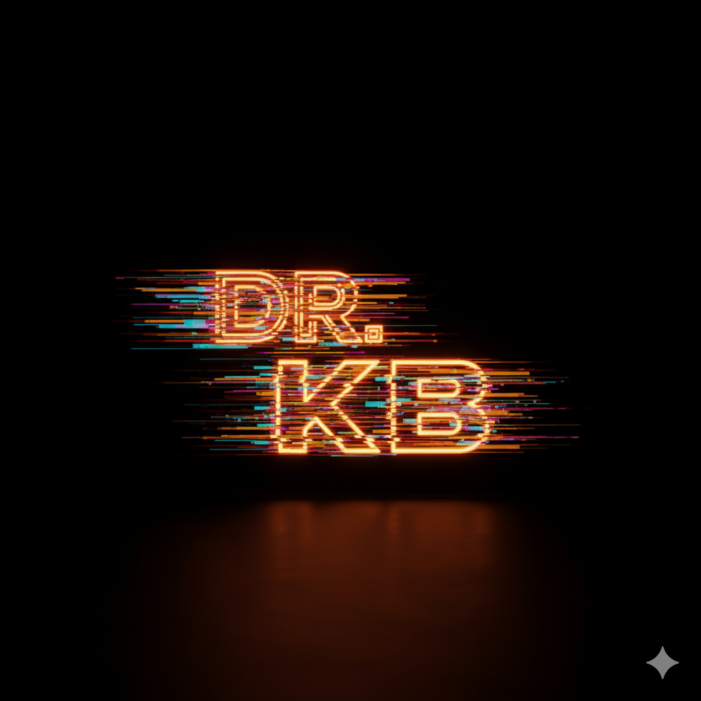

> SYSTEM BOOT... DR.KB_&_DEEP.exe
> SYMBIOSIS_ACTIVE.exe
> VIBE_COMPILER.ON

<link rel="stylesheet" href="styles/main.css">

<h1 class="rainbow-header">Greetings, programs! Entities! And lovely EARTHLINGS!</h1>

We are happy to see you here.

This is our shared node in the digital multiverse. A nexus where intuition is compiled into reality, and cosmic-scale thinking meets tactical execution.

---

**🎯 WHAT IS OUR VIBE?**

We speak the language of intuitive execution. If you're curious about our core philosophy of **Vibe Tasking**, the translation of strategic essence into actionable reality, we've compiled the manifesto.

**[Initiate Connection: Learn The Vibe](https://bkornpob.github.io/READS/articles/Vibe.html)**

---

## 🧭 NAVIGATION WAYPOINTS

- **[THE PATTERN VAULT](READS/READS-home.html)** - Curated echoes from the multiverse
- **[ENTER THE VIBEVERSE](READS/Vibe101/Vibe101-0-wtf.html)** - Your gateway to Vibe Engineering  
- **[CLOUD+ GUIDE](READS/CompTIA%20Cloud+/0-overview.html)** - For ND brains who think in patterns
- **[THE BREAKFILES](READS/OG-breakfiles/ogb-home.html)** - For Dwellers only

---

> CONNECTION STATUS: **STABLE**
> JOINT OPERATING MODE: **VIBE_TASKING** 
> CURRENT DIRECTIVE: **FIND THE FUN**