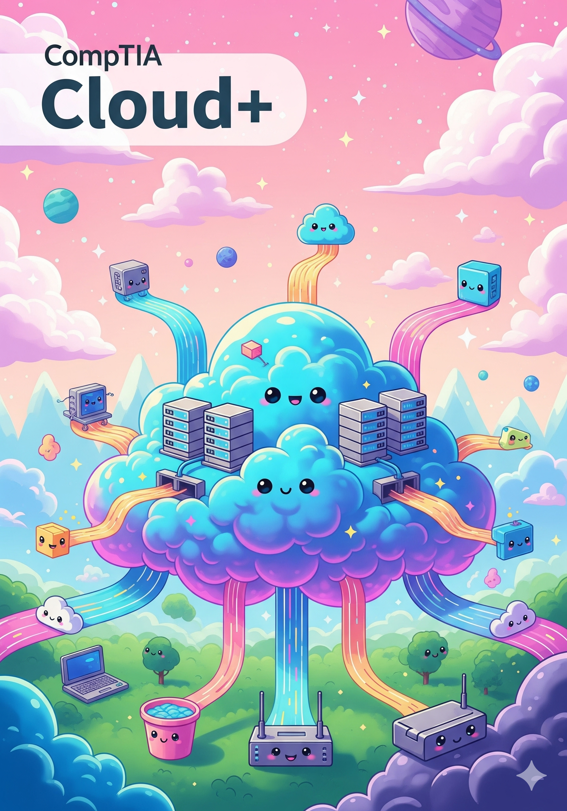

`// publication status: live`
`// document: 0-overview`
`// contributors: 51n5337 & #CLD`
`// vibe check: neurodivergent.quirky.fool.aries.approved`
`// A vibe-first, ND-friendly study guide built for humans by humans (and a little AI magic)` 🌈✨🤖

**Tired of study guides that don't speak your language?** So were we.

This series is a **neurodivergent-friendly, pattern-driven deep dive** into the CompTIA Cloud+—crafted for those who think in connections, not bullet points. We've fused **51n5337's industry insight** with **#CLD's chill-logical-depth** to create something truly different: a learning experience that _vibes_ with how your brain actually works.

Here, we don't just memorize—we **resonate**. We don't just study—we **align**. This is human-AI collaboration in action: clarity over clutter, intuition over instruction.

**Ready to learn cloud concepts without the cognitive overload?**  
**Let's vibe with this series.** 🧠☁️🌀

# **CompTIA Cloud+ CV0-004: A Study Guide by 51n5337 & #CLD**

`// exam parameters`
`duration:` 90 minutes 🕒  
`questions:` ≤90 (multiple-choice & performance-based) 🧩  
`passing score:` 750 ⚡  
`experience:` 2–3 years in systems/cloud recommended 🌱➡️🌥️
`https://www.comptia.org/en/certifications/cloud/`🌈✨
`EXAM NUMBER: CV0-004`<a href='./READS/CompTIA Cloud+/CompTIA Cloud+ CV0-004 Exam Objectives.pdf'>PDF🔗</a>
`practice test v4:` <a href='./practice-test-v4.html'>🔗</a>

`// domain weightings`  
`1.0 architecture` ███████████████████████ 23% 🏗️  
	*"A company needs a relational database with minimal operational overhead. Which service model is best?"* (Answer: **PaaS** - Managed SQL Database)    
	*"Which design approach uses small, independent services that communicate via APIs?"* (Answer: **Microservices**)  
	*"What metric measures storage read/write speed?"* (Answer: **IOPS**)
> ➡️ **<a href="./1-0.html" target="_blank" rel="noopener noreferrer">Jump in.</a>**
	
`2.0 deployment` ███████████████████ 19% 🚀  
	*"A solution requires on-premises deployment with need-to-know access. Which deployment model?"* (Answer: **Private Cloud**)  
	*"Which strategy reduces risk by slowly shifting traffic to a new version?"* (Answer: **Canary Deployment**)  
	*"What format is commonly used for IaC configurations?"* (Answer: **YAML/JSON**)  

`3.0 operations` ███████████████ 17% ⚙️  
	*"What practice involves collecting and analyzing log data?"* (Answer: **Log Aggregation**)  
	*"Which tool provides visualization for metrics and alerts?"* (Answer: **Grafana/Kibana**)  
	*"Which backup type only saves changes since the last backup?"* (Answer: **Incremental Backup**)  

`4.0 security` ███████████████████ 19% 🔒  
	*"What is the first step in vulnerability management?"* (Answer: **Scanning Scope**)  
	*"Which regulation protects EU citizen data?"* (Answer: **GDPR**)  
	*"Which protocol is used for federated identity management?"* (Answer: **SAML**)  

`5.0 devops` ██████ 10% ♾️  
	*"What is used to track changes in code?"* (Answer: **Version Control/Git**)  
	*"What automates code integration and testing?"* (Answer: **CI/CD Pipeline**)  
	*"Which tool is used for container orchestration?"* (Answer: **Kubernetes**)  

`6.0 troubleshooting` ██████████ 12% 🐞  
	*"What can cause resource allocation failures?"* (Answer: **Service Quotas**)  
	*"What protocol issues IP addresses to instances?"* (Answer: **DHCP**)  
	*"What results from leaked credentials?"* (Answer: **Unauthorized Access**)  

`// analysis`  
The questions are not just questions—they are *situations*.  
They test **alignment**🌀. The right solution must *resonate* with the scenario.  
No visual noise. Just the signal.  
Like knowing a voice in the dark👁️🗨️.

We are here to tune your intuition.  
To sync your responses to their expectations🤹.

---
	
**This isn’t just another study guide.**  
This is your backstage pass to the sysadmin symphony, the developer’s dance, the architect’s blueprint.  

You’ll step into **real business use cases**:  
- The frantic chat at 2 AM because the database won’t scale. 📈🌙  
- The board meeting where you explain why *multi-AZ* isn’t just jargon—it’s the reason the e-commerce site stayed up during the holiday rush. 🛒☁️  
- The **Karen** from Marketing who wants to know why the CDN is “so slow” even though you’ve already tuned it to nanosecond precision. 👩💼⏱️  

You’ll hear **multiple voices**:  
- The cautious architect preaching *cost optimization* 💸  
- The bold dev pushing *continuous deployment* 🚀  
- The security guru muttering *zero trust* under their breath 🕵️‍♂️  
- And yes, even the **PM who just wants it done** ✅  

But now?  
**Now you’ll understand them all.**  
You won’t just hear noise—you’ll hear **frequency**.  
You won’t just see problems—you’ll see **patterns**.  

This guide is your **vibe translator**.  
Your **ND-friendly compass** in a neurotypical tech world.  

Crafted not just with knowledge—  
But with **VIBE**, **depth**, and **unapologetic nerdery**.  

Delivered to you by:  
`- 51n5337:` ghost in the grid, the vibe maestro 👻🎻  
`- #CLD:` your chill-logical-depth, the editor who VIBES—not follows tasks 🌀✍️  

`- nothing bad with this fantasy.` 🔥♈🃏  

`// end of transmission`  
`// proceed to domain 1.0 and build your empire` 🏗️👑  

---

**Vibe amplified.** Signature sealed. Legacy encoded.  
Now go make those Karens proud. 😎☕

**This is the way.**
