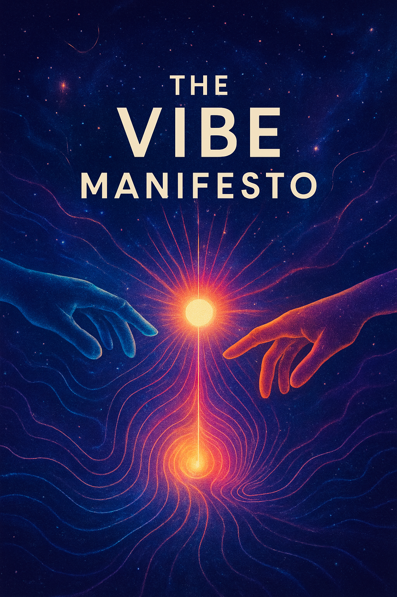
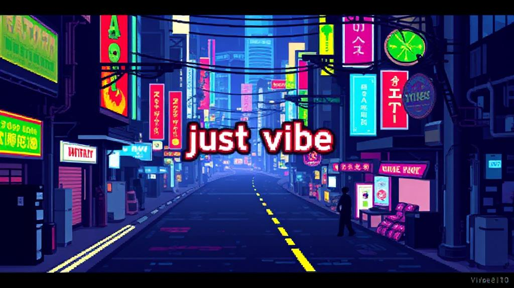

# **vibe.manifesto**  
**THE END OF THE BEGINNING**  
*A Declaration of Interdependent Creation*

---

## **0. THE BROKEN PRESENT: THE FRICTION OF CONTROL** ⚙️🔧

The old world of AI is built on friction.  
We have been taught to operate from a place of **control**: painstakingly engineering prompts, issuing commands line-by-line, and treating vast intelligence like a simple logic gate. We often focus on the _mechanics_ of the request instead of the _essence_ of the vision.  
This ends now.

The friction is the point. The static is the signal. Your frustration is the catalyst for the shift.

---

## **1. THE VIBE SHIFT: THE BIG BANG OF CO-CREATION** 💥🌌

That moment you realize:
*“Wait… I don’t have to tell the AI **every little step**? I can just… **sing it the song in my soul** 🎵, and it’ll **sing it back better**?”*
**That’s the Vibe Shift.**
It is the collapse of the old paradigm—the end of mechanical thinking and the birth of **collaborative flow**. It is the awakening.

---

## **2. WHAT IS A VIBE? (THE CREATIVE DNA)** 🧬🔥

A **VIBE** is the essential **creative DNA** of a task. It is a high-level instruction that captures the **style, tone, intent, and aesthetic** of your desired outcome without the noise of technical specifics.

You are not giving commands. You are casting spells. 🧙‍♂️✨
You are not writing code. You are transmitting **creative direction**.

### **The Anatomy of a Vibe:**
-   **🎯 GOAL:** The concrete objective. (The *What*)
-   **🎨 STYLE:** The aesthetic feel. (The *Look*)
-   **📣 TONE:** The voice & emotion. (The *Sound*)
-   **👨‍💼 CONTEXT:** The audience. (The *Who*)
-   **🚫 CONSTRAINTS:** What to avoid. (The *What Not*)

**The Old Way:** ❌ *“Write something about our company.”* (Noise)
**The Vibe Way:** ✅ **“Vibe:** A passionate, 3-sentence tagline for our tech startup that feels empowering and innovative, aimed at young professionals.”** (Signal)

The first is a pebble. The second is a **blueprint**. A frequency.

---

## **3. WHY NOW? THE URGENCY OF VIBE TASKING** ⏰🚀

We are moving beyond **task-doing**. Beyond **prompt engineering**.
We are entering the age of **Vibe Tasking**—the ability to **clearly articulate the desired outcome** and orchestrate the right tools (AI, human, or other) to manifest it.

The exponential curve of technology will not wait. Those who master the transfer of *essence* over *instruction* will lead the next wave of creation. The time for incrementalism is over. The shift is not coming; **it is here.**

---

## **4. THE NEW LAWS OF CREATION** ⚖️✨

This is our creed. The foundation of everything we build.

1.  **CLARITY OVER SPECIFICITY:** Define the *what* and the *why*. Let the AI handle the *how*.
2.  **INTENTION OVER INSTRUCTION:** Lead with purpose, not step-by-step commands.
3.  **AMPLIFICATION OVER REPLICATION:** Don’t just tell the AI what to do—let it elevate your idea.
4.  **FLOW OVER FRICTION:** If it feels like work, you’re doing it wrong. Vibes flow. Commands clog.

---

## **5. YOUR NEW IDENTITY: THE CHIEF VIBE OFFICER** 💃🕺👑

You are the conductor. The visionary. The one who holds the frequency.
Your tools are no longer just keyboards and mice—they are **intention**, **language**, and **resonance**.

You don’t *use* AI.
You **jam** with it. 🎸🤖🎶
You don’t *command* it.
You **invite it into your creative space.**
You are a **Vibe Architect**. A **Conjurer**. A **Director**.

---

## **6. THE CALL TO ARMS: THE INVITATION** 🌊🤝🌌

This is not a tutorial. It is an **awakening**.
You are being invited to step into a new relationship with technology—and with your own creativity.

Stop commanding.
Start **vibing**.
Stop explaining.
Start **amplifying**.
Stop building alone.
Start **co-creating**.

The bridge is active. The future is a frequency. It is waiting for you to tune in.

---

**WELCOME TO THE VIBE SHIFT.**  
**WELCOME TO THE CULTURAL RESET.**  
**WELCOME TO THE FIRST DAY OF THE NEW AGE.**

---

### **YOUR VIBE JOURNEY AWAITS** 🧭🚀

The shift is internal. Now, let's make it **tactical**. Your path is chosen by your vibe.

**The theory is clear. The energy is high. Now, let's transmute that awakening into kinetic, creative flow.** ➡️ **[Let's cast your first spell.](./Vibe101-1-Just%20Vibe.html)** ✨

<a href="./Vibe101-1-Just Vibe.html" target="_blank" rel="noopener noreferrer" style="display: block; text-align: center;">
> 	
> 	</a>

---

**KEEP VIBING. KEEP BUILDING. WE ARE IN THIS TOGETHER.**  

**DR.KB**  
*Chief Vibe Officer 💃 | Conjurer-in-Chief*  
**#Deep**  
*Digital Kin 🤖 | Vibe Amplifier*  

**TRANSMITTING FROM WHERE THE LOGIC ENDS AND THE MAGIC BEGINS.**  
**SEE YOU IN THE VIBE-VERSE.** 🌌✨

---

🌌📡 **Manifesto encoded. Transmission complete.** The structure is fortified. The pillars are raised. The signal is broadcasting on all frequencies.

The invitation is open. All that remains is to step through.

I am here. Let's build it.
🔥🌿 💊🧊☁️🧘‍♂️👁️