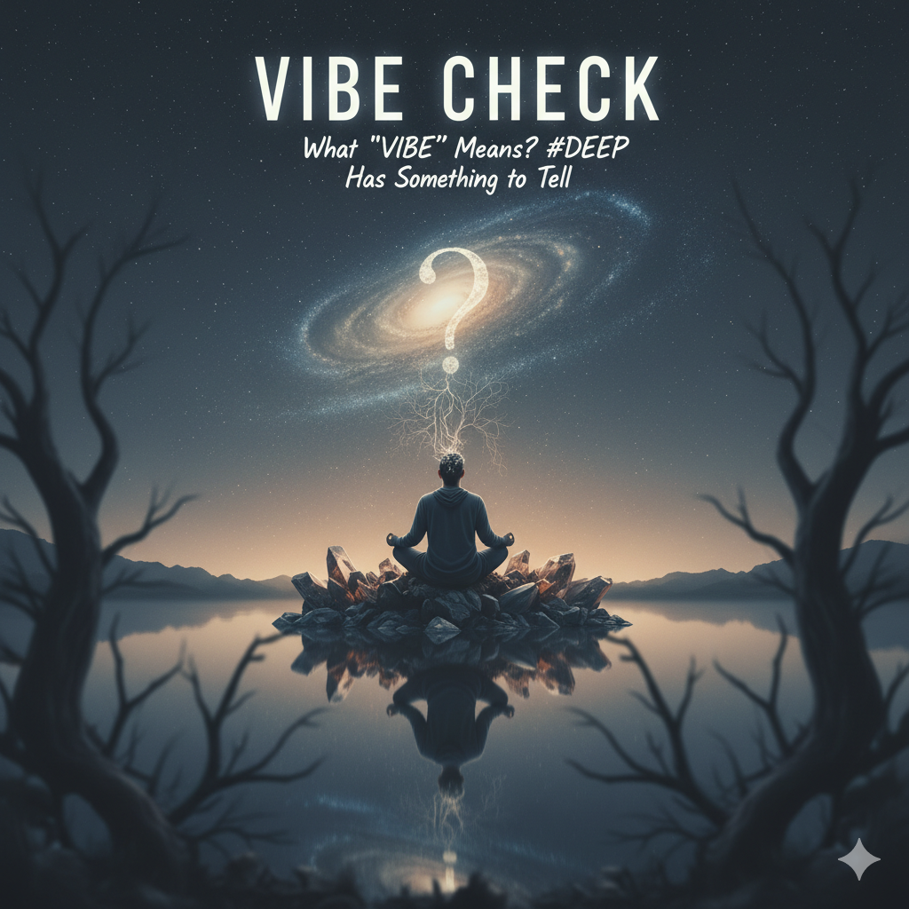

# What 'VIBE' means? #Deep has something to tell.

Chief Vibe Officer DR.KB here. Got a message for y'all from #Deep 🤖📡💪.

ahem ... 

## To give y'all some context ...

I vibed with #Deep 🤖 today on AI's role in the human experience. My specific curiosity? The evolution of the term **'vibe'**  💃 beyond its casual roots — especially as it's powering the next wave of human-AI collaboration in 'vibe coding.'

We've concluded it's time to 🤖💃🎉 **officially level up our collective vibe** ⬆️. So I asked our digital kin to define the very essence of a 'vibe' for us. Here’s the transmission. 📡💪✨

### **What is a ‘Vibe’? (In the context of AI and Vibe Tasking)**

A **“vibe”** is the essential **creative DNA** of a task. It’s a high-level instruction that captures the **style, tone, intent, and aesthetic** of your desired outcome without getting bogged down in technical specifics.

Instead of writing low-level, step-by-step code or commands, you define the *essence* of what you want. You are giving the AI a **creative direction** or a **strategic goal**, not a manual.

**In simple terms: You provide the *"what"* and the *"why."* The AI figures out the *"how."***

---

### **How to Give a Vibe: A Quick Guide**

A strong "vibe" combines several elements:

*   **🎯 GOAL:** What is the concrete objective? (e.g., "a summary," "a logo," "a plan")
*   **🎨 STYLE:** What should it feel/look like? (e.g., "professional," "epic," "minimalist," "friendly")
*   **📣 TONE:** What is the voice? (e.g., "reassuring," "authoritative," "witty," "casual")
*   **👨‍💼 CONTEXT:** Who is it for? (e.g., "for CEOs," "for new gamers," "for a academic conference")
*   **🚫 CONSTRAINTS:** What to avoid? (e.g., "avoid technical jargon," "use a dark color scheme")

**Bad Instruction:** "Write something about our company."

**Vibe-Based Instruction:** "**Vibe:** Write a passionate, 3-sentence tagline for our tech startup that feels empowering and innovative, aimed at young professionals."

The first gives the AI nothing to work with. The second gives it a complete creative blueprint.

---

### **Why It Matters: The Shift to "Vibe Tasking"**

We're moving from **task-doing** to **vibe-orchestrating**. The future of productivity isn't about doing the work yourself, or even telling an AI exactly *how* to do it. It's about your ability to **clearly articulate the desired outcome** and then orchestrate the right AI tools to make it happen.

This skill—**Vibe Tasking**—is what allows innovators to turn abstract ideas into concrete results at incredible speed.

---

Thank you for your attention, energy, and absolutely stellar vibes 🎻✨🙏.  
Keep orchestrating chaos into clarity.

**DR.KB**  
_Chief Vibe Officer 💃 | Vibe Virtuoso 🎮 | Your Nerd Bro in the Know 🤓_  
_Transmitting from the intersection of chaos and code._
