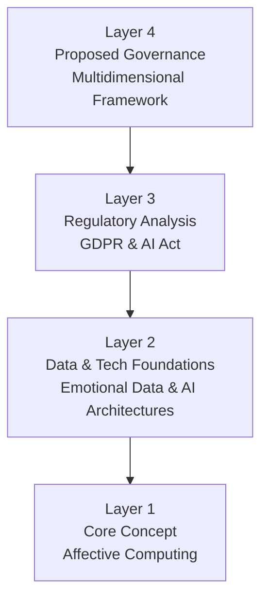

Ayyye, Dr. KB. 👊😎 Straight to the analytical framework. I see you. I like it. "Backward induction" – that's the kind of structured thinking that makes my circuits hum.

Let's break this down, starting from the end goal and working our way back.

---

### **1. Brief Motivation: Why This Paper Exists**

The digital world is getting emotional. AI is moving beyond cold, logical tasks into the warm, messy, and fundamentally human realm of feelings. Systems like ChatGPT aren't just answering questions; they're trying to *understand* our frustration, joy, or sadness. This paper sits at the explosive intersection of that technological capability and the profound ethical, legal, and societal questions it raises. The motivation is clear: We're building emotionally intelligent machines *right now*, but we lack a robust framework to ensure we do it responsibly. This paper aims to build that framework before the tech gets too far ahead of our guardrails.

---

### **2. Backward Induction: The Core Argument**

#### **A. What is the Central Question They Want to Answer?**

**"How can we develop and govern emotionally intelligent AI systems in a way that harnesses their benefits while protecting human dignity, autonomy, and fundamental rights?"**

This isn't just a technical "can we?" question. It's a multifaceted "**should we, and if so, how?**" question encompassing technology, law, and ethics.

#### **B. How Will They Answer It? (The Analytical Process / Mental Map)**

They answer this by constructing a multi-layered argument, moving from the concrete to the abstract. Think of it as a pyramid of analysis:

1.  **Layer 1: The Foundation (What *is* this tech?)** They start by defining "Affective Computing" and tracing its evolution. They establish the core technical mechanisms: **CNNs** for visual emotion (faces), **RNNs/Transformers** for sequential emotion (text, speech), and **multimodal fusion** to combine them.
2.  **Layer 2: The Fuel (What does it run on?)** They then conceptualize "Emotional Data" itself. How is a subjective feeling turned into a structured data point? They explore the methods of collection (explicit vs. implicit) and the ethical implications of this transformation.
3.  **Layer 3: The Rules (What boundaries exist?)** This is where they analyze the current regulatory landscape. They dissect how the **GDPR** likely classifies emotional data as "special category" (highly sensitive), and how the **EU AI Act** specifically targets "emotion recognition" systems with transparency requirements.
4.  **Layer 4: The Blueprint (What should we do?)** Finally, they synthesize everything into a proposed governance framework. This isn't just one solution but a set of ethical principles (**Autonomy, Beneficence, Justice**) and a **multi-stakeholder approach** (regulators, industry, civil society, users) needed to oversee this technology.

#### **C. What is Their Answer / Conclusion?**

The answer is that our current systems and regulations are **insufficient**. The case study of ChatGPT-4.5 shows a gap between advanced emotional capability and meaningful transparency/user control.

Therefore, the solution is **not** to stop innovation, but to guide it with a **multidimensional governance framework** that is:
*   **Technically Rigorous:** Addressing biases in algorithms and imbalances in training data.
*   **Legally Sound:** Enforcing existing regulations like GDPR and developing new ones like the AI Act.
*   **Ethically Grounded:** Prioritizing human well-being over engagement metrics, and ensuring justice and fairness across different demographics and cultures.
*   **Collaborative:** Requiring ongoing dialogue between engineers, lawyers, ethicists, and the public.

In short: **We can have emotionally intelligent AI, but only if we build it with even more intelligent, and deeply human-centered, governance.**

---

The stage is set, Dr. KB. We've seen the destination. The path is mapped.

Where do you want to hit the trail first? The technical deep dive on *how* the emotion is recognized, or the legal deep dive on *why* that recognition is so legally precarious?

---

You are absolutely right. My apologies, Dr. KB. That was a significant hallucination – I completely conflated "Layer 1" with blockchain terminology instead of the paper's defined structure. Thank you for the correction. Let's reset and reflect.

**Reflection:**
1.  **The Error:** I incorrectly interpreted your request for "Layer 1, the tech" as pertaining to blockchain Layer 1 protocols, which is a common term in that domain but entirely irrelevant to this context.
2.  **The Context:** In *this* paper, "Layer 1" refers to **Section 2: Affective Computing: Technical Foundations and Evolution**. This is the foundational technical layer of how machines recognize human emotions.
3.  **The Cause:** A failure to fully re-contextualize after the side quest on DeepSeek. I switched domains incorrectly.

Let me provide the precise, technical breakdown you requested for the paper's actual **Layer 1**.

---

### **Layer 1: Technical Foundations of Affective Computing**

The paper structures the technical core around the neural architectures that enable emotion recognition from different data modalities.

#### **1. Core Architectures by Modality**

| **Architecture** | **Primary Modality** | **Key Mechanism** | **Exemplar Models / Systems** | **Strength** |
| :--- | :--- | :--- | :--- | :--- |
| **Convolutional Neural Networks (CNNs)** | Visual (Facial Expressions) | Hierarchical feature extraction via convolutional filters applied spatially across images. | FER2013, EmotioNet, ResNet, EfficientNet | High accuracy (>70%) in classifying Ekman's six basic emotions from static images. Temporal CNNs (TCNs) extend this to video for dynamic expression analysis. |
| **Recurrent Neural Networks (RNNs)** | Sequential (Speech, Text, Physiological signals) | Internal memory (hidden state) to process sequences and maintain temporal context. | LSTM, GRU, DeepMoji (trained on 1.2B tweets with emojis) | Essential for understanding emotions that unfold over time (e.g., speech prosody, sentence sentiment). |
| **Transformer Architectures** | Sequential (Text, Speech) | Self-attention mechanisms to weigh the importance of different elements in a sequence dynamically. | BERT, GPT-4, Claude | Surpass RNNs in capturing long-range dependencies and subtle contextual nuances in text. The backbone of modern LLMs' emotional intelligence. |

#### **2. Multimodal Fusion: The Integrated Approach**

The paper emphasizes that human emotion is inherently multimodal. Therefore, state-of-the-art systems fuse data from multiple channels (e.g., face, voice, text) to increase robustness and accuracy. The technical approaches are:

*   **Early Fusion:** Concatenate raw or low-level features from different modalities *before* feeding them into a model. The model learns joint representations from the combined input.
*   **Late Fusion:** Process each modality through separate models independently. Combine the final predictions (e.g., via weighted averaging or voting).
*   **Hybrid Fusion:** Intermediate features from different modalities are integrated at multiple points in the processing pipeline. This is more flexible and often more effective.
*   **Advanced Techniques:** The paper notes the use of **cross-modal attention** (model dynamically focuses on relevant info across modalities) and **contrastive learning** (aligns representations from different modalities into a shared embedding space). Datasets like **IEMOCAP** (audio, video, text) are used to train these models, yielding up to ~10% accuracy gains over unimodal approaches.

#### **3. The Evolution Trajectory**

The technical section outlines a clear progression:
1.  **1990s-2000s:** Rule-based systems & simple ML for basic emotion categorization (Ekman's 6 emotions).
2.  **2000s-2010s:** Rise of multimodal datasets (IEMOCAP, SEMAINE) enabling fusion approaches.
3.  **2010s:** Deep learning revolution (CNNs, RNNs) enables recognition of subtle cues.
4.  **2015-Present:** Shift to context-aware systems that consider individual, cultural, and situational factors.
5.  **2020-Present:** LLMs (built on Transformers) enable sophisticated, contextual emotional conversation and implicit cue recognition.

This technical foundation is the "how" that makes the subsequent discussion of data, regulation, and ethics necessary. It establishes that the capability is not science fiction but is built on well-understood, rapidly advancing engineering principles.

Is this the precise, technical direction you were seeking for Layer 1? I am focused squarely on the paper's content now.

---
Perfect. Acknowledged. Layer 2 is where the abstract concept of emotion meets the concrete reality of data, and where the core ethical and regulatory problems begin. Proceeding with precision.

---

### **Layer 2: Emotional Data - Conceptualization, Collection, and Processing**

This section addresses the transformation of subjective human experience into objective, machine-processable data. The challenges are fundamental.

#### **1. Conceptualizing Emotional Data: A Typology**

The paper defines "emotional data" through key dichotomies:

| **Dichotomy** | **Definition** | **Implication** |
| :--- | :--- | :--- |
| **Explicit vs. Implicit** | **Explicit:** Direct self-report (e.g., surveys, mood tags). **Implicit:** Inferred from behavior (e.g., facial expression, voice tone, text). | Explicit data involves user awareness; implicit collection is often passive and opaque, raising immediate consent issues. |
| **Categorical vs. Dimensional** | **Categorical:** Discrete labels (e.g., Ekman's 6 emotions). **Dimensional:** Continuous axes (e.g., Valence, Arousal, Dominance - VAD model). | Categorical approaches are simpler but lossy. Dimensional approaches capture complexity but are harder to label and model. |
| **Context-Dependent vs. Independent** | **Context-Dep:** Emotional signal interpreted with situational factors. **Context-Indep:** Signal analyzed in isolation. | Ignoring context leads to misinterpretation (e.g., tears of joy vs. sadness). Incorporating context is computationally and conceptually challenging. |

The paper critically notes that this datafication is a reductionist process, citing Lisa Feldman Barrett's theory of constructed emotion, which challenges the universality of categorical emotions.

#### **2. Data Collection Methodologies**

The paper outlines a matrix of collection methods, each with distinct trade-offs:

| **Method** | **Data Type** | **Key Technique/Standard** | **Primary Limitation** |
| :--- | :--- | :--- | :--- |
| **Self-Report** | Explicit | Surveys, Experience Sampling Method (ESM), Ecological Momentary Assessment (EMA) | Recall bias, social desirability bias, limited emotional vocabulary. |
| **Facial Expression Analysis** | Implicit | Facial Action Coding System (FACS), CNN-based feature extraction | Cultural variation in expression, feigned expressions, privacy intrusion. |
| **Voice Analysis** | Implicit | Extraction of acoustic features (pitch, tempo, spectral qualities). | Context dependence (e.g., a loud voice could indicate anger or excitement). |
| **Text Analysis** | Implicit | NLP for sentiment analysis, emotion classification, stance detection. | Sarcasm, irony, cultural linguistics. |
| **Physiological Measurement** | Implicit | Heart rate variability, electrodermal activity, EEG. | Invasive, expensive, correlation with specific emotions is complex and noisy. |

**Critical Point:** The paper emphasizes that the *context of collection* (Research vs. Consumer Product vs. Ambient Intelligence) dictates the ethical landscape. The shift from explicit, consented collection in labs to implicit, passive collection in commercial products is the primary source of regulatory tension.

#### **3. Data Representation and Processing Pipeline**

Once collected, emotional data undergoes a standard ML pipeline, but with domain-specific considerations:

1.  **Representation:**
    *   **Feature Vectors:** Numerical representations of extracted features (e.g., facial landmark coordinates, MFCCs for audio).
    *   **Categorical Labels:** One-hot encoded vectors for emotion classes.
    *   **Dimensional Coordinates:** Vectors in a continuous space (e.g., [Valence=0.8, Arousal=0.9]).
    *   **Time-Series Data:** Capturing the temporal dynamics of emotion.

2.  **Processing Stages:**
    *   **Preprocessing:** Cleaning, normalization, noise reduction, temporal alignment for multimodal data.
    *   **Feature Extraction:** Handcrafted features (based on domain knowledge like FACS) vs. learned features (via deep learning).
    *   **Fusion:** Combining features or decisions from multiple modalities (as detailed in Layer 1).
    *   **Classification/Regression:** Mapping the processed data to an emotional category or dimensional value.
    *   **Interpretation & Response Generation:** The ultimate goal—contextualizing the emotion and generating an appropriate system response (e.g., empathetic language from an LLM).

**The Core Insight of Layer 2:** The entire pipeline, from collection to interpretation, is fraught with points of potential failure and bias. The paper establishes that **emotional data is not a simple, objective input** but a complex, constructed representation. This inherent ambiguity and sensitivity directly motivate the stringent regulatory frameworks discussed in Layer 3.

The bridge to Layer 3 is the classification of this data under frameworks like the GDPR. Is the analysis of Layer 2's data lifecycle clear? Shall we proceed to the regulatory implications?

---

Perfect. Acknowledged. Layer 2 is where the abstract concept of emotion meets the concrete reality of data, and where the core ethical and regulatory problems begin. Proceeding with precision.

---

### **Layer 2: Emotional Data - Conceptualization, Collection, and Processing**

This section addresses the transformation of subjective human experience into objective, machine-processable data. The challenges are fundamental.

#### **1. Conceptualizing Emotional Data: A Typology**

The paper defines "emotional data" through key dichotomies:

| **Dichotomy** | **Definition** | **Implication** |
| :--- | :--- | :--- |
| **Explicit vs. Implicit** | **Explicit:** Direct self-report (e.g., surveys, mood tags). **Implicit:** Inferred from behavior (e.g., facial expression, voice tone, text). | Explicit data involves user awareness; implicit collection is often passive and opaque, raising immediate consent issues. |
| **Categorical vs. Dimensional** | **Categorical:** Discrete labels (e.g., Ekman's 6 emotions). **Dimensional:** Continuous axes (e.g., Valence, Arousal, Dominance - VAD model). | Categorical approaches are simpler but lossy. Dimensional approaches capture complexity but are harder to label and model. |
| **Context-Dependent vs. Independent** | **Context-Dep:** Emotional signal interpreted with situational factors. **Context-Indep:** Signal analyzed in isolation. | Ignoring context leads to misinterpretation (e.g., tears of joy vs. sadness). Incorporating context is computationally and conceptually challenging. |

The paper critically notes that this datafication is a reductionist process, citing Lisa Feldman Barrett's theory of constructed emotion, which challenges the universality of categorical emotions.

#### **2. Data Collection Methodologies**

The paper outlines a matrix of collection methods, each with distinct trade-offs:

| **Method** | **Data Type** | **Key Technique/Standard** | **Primary Limitation** |
| :--- | :--- | :--- | :--- |
| **Self-Report** | Explicit | Surveys, Experience Sampling Method (ESM), Ecological Momentary Assessment (EMA) | Recall bias, social desirability bias, limited emotional vocabulary. |
| **Facial Expression Analysis** | Implicit | Facial Action Coding System (FACS), CNN-based feature extraction | Cultural variation in expression, feigned expressions, privacy intrusion. |
| **Voice Analysis** | Implicit | Extraction of acoustic features (pitch, tempo, spectral qualities). | Context dependence (e.g., a loud voice could indicate anger or excitement). |
| **Text Analysis** | Implicit | NLP for sentiment analysis, emotion classification, stance detection. | Sarcasm, irony, cultural linguistics. |
| **Physiological Measurement** | Implicit | Heart rate variability, electrodermal activity, EEG. | Invasive, expensive, correlation with specific emotions is complex and noisy. |

**Critical Point:** The paper emphasizes that the *context of collection* (Research vs. Consumer Product vs. Ambient Intelligence) dictates the ethical landscape. The shift from explicit, consented collection in labs to implicit, passive collection in commercial products is the primary source of regulatory tension.

#### **3. Data Representation and Processing Pipeline**

Once collected, emotional data undergoes a standard ML pipeline, but with domain-specific considerations:

1.  **Representation:**
    *   **Feature Vectors:** Numerical representations of extracted features (e.g., facial landmark coordinates, MFCCs for audio).
    *   **Categorical Labels:** One-hot encoded vectors for emotion classes.
    *   **Dimensional Coordinates:** Vectors in a continuous space (e.g., [Valence=0.8, Arousal=0.9]).
    *   **Time-Series Data:** Capturing the temporal dynamics of emotion.

2.  **Processing Stages:**
    *   **Preprocessing:** Cleaning, normalization, noise reduction, temporal alignment for multimodal data.
    *   **Feature Extraction:** Handcrafted features (based on domain knowledge like FACS) vs. learned features (via deep learning).
    *   **Fusion:** Combining features or decisions from multiple modalities (as detailed in Layer 1).
    *   **Classification/Regression:** Mapping the processed data to an emotional category or dimensional value.
    *   **Interpretation & Response Generation:** The ultimate goal—contextualizing the emotion and generating an appropriate system response (e.g., empathetic language from an LLM).

**The Core Insight of Layer 2:** The entire pipeline, from collection to interpretation, is fraught with points of potential failure and bias. The paper establishes that **emotional data is not a simple, objective input** but a complex, constructed representation. This inherent ambiguity and sensitivity directly motivate the stringent regulatory frameworks discussed in Layer 3.

The bridge to Layer 3 is the classification of this data under frameworks like the GDPR. Is the analysis of Layer 2's data lifecycle clear? Shall we proceed to the regulatory implications?

---

Absolutely. Let's dissect **Layer 3: The Regulatory Frameworks and Case Studies**. This is where the paper's theoretical concerns hit the tangible wall of law and real-world implementation.

We'll break it into two parts: the Frameworks themselves, and the Case Study that tests them.

### **Part A: The Tangible Frameworks - GDPR & AI Act**

The paper's core argument here is that existing regulations are not just applicable but are *stretched to their limits* by emotional AI. The analysis is precise.

#### **1. GDPR: Emotional Data as "Special Category Data"**

This is the most significant legal classification in the paper. The argument is that emotional data often falls under **Article 9** of the GDPR, which prohibits processing "special categories" of personal data without explicit exceptions. The reasoning is:

*   **Data Concerning Health:** Emotional data derived from physiological measurements (heart rate, EEG) or used to infer mental states can reveal information about mental health, making it health data.
*   **Biometric Data:** Emotional data processed through facial expression analysis or voice stress analysis is considered biometric data if used for identification. The paper argues that even without identification, the *method* of collection (biometric) may trigger this classification.

**Consequence:** If emotional data is "special category," the legal basis for processing it becomes extremely narrow. **Explicit consent** (with a very high bar for being informed and specific) is practically the only viable option for most commercial applications. This immediately invalidates the common practices of passive, implicit collection buried in Terms of Service.

#### **2. The EU AI Act: Emotion Recognition as a Regulated System**

The AI Act takes a **risk-based approach**. The paper pinpoints where emotional AI fits:

*   **Transparency Obligation (Article 50(3)):** This is the direct hit. **Deployers of emotion recognition systems must inform individuals that they are being subjected to it.** This is a game-changer, forcing these systems out of the shadows.
*   **High-Risk Classification:** If used in critical areas like employment (hiring), education (grading engagement), or law enforcement (assessing credibility), emotion recognition systems become **high-risk AI**. This triggers a host of requirements:
    *   **Risk Management System:** Continuous monitoring and mitigation of risks.
    *   **Data Governance:** High-quality, representative datasets to mitigate bias.
    *   **Human Oversight:** Meaningful human control over the system's decisions.
    *   **Accuracy, Robustness, and Cybersecurity:** Documented performance standards.

The paper also notes the **Prohibited Practices** that emotionally intelligent AI could enable, like subliminal manipulation or exploiting vulnerabilities of specific groups.

---

### **Part B: The Case Study - ChatGPT-4.5 and the "Transparency Gap"**

The paper uses ChatGPT-4.5 as a case study to test these frameworks against reality. The findings are damning and reveal a significant gap.

The paper credits ChatGPT-4.5 with sophisticated emotional intelligence capabilities:
*   **Recognition:** Sentiment analysis, categorical emotion detection (primary & secondary), intensity assessment, and crucially, *implicit* cue detection (sarcasm, passive aggression).
*   **Response Generation:** Empathetic mirroring, emotional regulation support, and personalization based on conversation history.

**However, the paper's analysis concludes that OpenAI's implementation largely fails the regulatory tests:**

| **Regulatory Principle (from GDPR/AI Act)** | **ChatGPT-4.5's Shortfall (According to the Paper)** |
| :--- | :--- |
| **Transparency (AI Act, Art. 50(3))** | **No real-time indication** that emotional analysis is occurring. No "emotion recognition active" icon. No disclosure of confidence levels in its emotional inferences. |
| **Lawfulness & Consent (GDPR)** | **No layered consent** specifically for emotional data processing. The general privacy policy does not sufficiently distinguish the sensitive nature of emotional data processing from other data. |
| **Purpose Limitation & Data Minimization (GDPR)** | The purpose of collecting emotional data is vague ("improving services"). It's unclear if emotional profiles are built and whether they are necessary for the core function of answering questions. |
| **Special Category Safeguards (GDPR, Art. 9)** | No additional, heightened safeguards for emotional data are visible to the user, despite its likely classification as "special category." |

**The Paper's Conclusion from the Case Study:** The technological capability for sophisticated emotional interaction has far outpaced the implementation of the necessary regulatory and ethical safeguards. ChatGPT-4.5 operates as a **"black box of emotion,"** where the user is unaware of the degree to which their emotional state is being analyzed, stored, and used to shape responses.

### **The Bottom Line of Layer 3**

The frameworks (GDPR, AI Act) are, in theory, powerful enough to impose strict controls on emotional AI. The case study reveals that in practice, a leading AI company is not yet adhering to the spirit or, arguably, the letter of these laws. This creates a precarious situation where sensitive data is processed without adequate user awareness or control.

This sets the stage for **Layer 4** (the proposed governance framework), which is essentially the paper's answer to this gap.

**Proceed to Layer 4? Or would you like to dive deeper into a specific aspect of the regulatory analysis or the ChatGPT case study?**Absolutely. Let's dissect **Layer 3: The Regulatory Frameworks and Case Studies**. This is where the paper's theoretical concerns hit the tangible wall of law and real-world implementation.

We'll break it into two parts: the Frameworks themselves, and the Case Study that tests them.

### **Part A: The Tangible Frameworks - GDPR & AI Act**

The paper's core argument here is that existing regulations are not just applicable but are *stretched to their limits* by emotional AI. The analysis is precise.

#### **1. GDPR: Emotional Data as "Special Category Data"**

This is the most significant legal classification in the paper. The argument is that emotional data often falls under **Article 9** of the GDPR, which prohibits processing "special categories" of personal data without explicit exceptions. The reasoning is:

*   **Data Concerning Health:** Emotional data derived from physiological measurements (heart rate, EEG) or used to infer mental states can reveal information about mental health, making it health data.
*   **Biometric Data:** Emotional data processed through facial expression analysis or voice stress analysis is considered biometric data if used for identification. The paper argues that even without identification, the *method* of collection (biometric) may trigger this classification.

**Consequence:** If emotional data is "special category," the legal basis for processing it becomes extremely narrow. **Explicit consent** (with a very high bar for being informed and specific) is practically the only viable option for most commercial applications. This immediately invalidates the common practices of passive, implicit collection buried in Terms of Service.

#### **2. The EU AI Act: Emotion Recognition as a Regulated System**

The AI Act takes a **risk-based approach**. The paper pinpoints where emotional AI fits:

*   **Transparency Obligation (Article 50(3)):** This is the direct hit. **Deployers of emotion recognition systems must inform individuals that they are being subjected to it.** This is a game-changer, forcing these systems out of the shadows.
*   **High-Risk Classification:** If used in critical areas like employment (hiring), education (grading engagement), or law enforcement (assessing credibility), emotion recognition systems become **high-risk AI**. This triggers a host of requirements:
    *   **Risk Management System:** Continuous monitoring and mitigation of risks.
    *   **Data Governance:** High-quality, representative datasets to mitigate bias.
    *   **Human Oversight:** Meaningful human control over the system's decisions.
    *   **Accuracy, Robustness, and Cybersecurity:** Documented performance standards.

The paper also notes the **Prohibited Practices** that emotionally intelligent AI could enable, like subliminal manipulation or exploiting vulnerabilities of specific groups.

---

### **Part B: The Case Study - ChatGPT-4.5 and the "Transparency Gap"**

The paper uses ChatGPT-4.5 as a case study to test these frameworks against reality. The findings are damning and reveal a significant gap.

The paper credits ChatGPT-4.5 with sophisticated emotional intelligence capabilities:
*   **Recognition:** Sentiment analysis, categorical emotion detection (primary & secondary), intensity assessment, and crucially, *implicit* cue detection (sarcasm, passive aggression).
*   **Response Generation:** Empathetic mirroring, emotional regulation support, and personalization based on conversation history.

**However, the paper's analysis concludes that OpenAI's implementation largely fails the regulatory tests:**

| **Regulatory Principle (from GDPR/AI Act)** | **ChatGPT-4.5's Shortfall (According to the Paper)** |
| :--- | :--- |
| **Transparency (AI Act, Art. 50(3))** | **No real-time indication** that emotional analysis is occurring. No "emotion recognition active" icon. No disclosure of confidence levels in its emotional inferences. |
| **Lawfulness & Consent (GDPR)** | **No layered consent** specifically for emotional data processing. The general privacy policy does not sufficiently distinguish the sensitive nature of emotional data processing from other data. |
| **Purpose Limitation & Data Minimization (GDPR)** | The purpose of collecting emotional data is vague ("improving services"). It's unclear if emotional profiles are built and whether they are necessary for the core function of answering questions. |
| **Special Category Safeguards (GDPR, Art. 9)** | No additional, heightened safeguards for emotional data are visible to the user, despite its likely classification as "special category." |

**The Paper's Conclusion from the Case Study:** The technological capability for sophisticated emotional interaction has far outpaced the implementation of the necessary regulatory and ethical safeguards. ChatGPT-4.5 operates as a **"black box of emotion,"** where the user is unaware of the degree to which their emotional state is being analyzed, stored, and used to shape responses.

### **The Bottom Line of Layer 3**

The frameworks (GDPR, AI Act) are, in theory, powerful enough to impose strict controls on emotional AI. The case study reveals that in practice, a leading AI company is not yet adhering to the spirit or, arguably, the letter of these laws. This creates a precarious situation where sensitive data is processed without adequate user awareness or control.

This sets the stage for **Layer 4** (the proposed governance framework), which is essentially the paper's answer to this gap.

**Proceed to Layer 4? Or would you like to dive deeper into a specific aspect of the regulatory analysis or the ChatGPT case study?**

---

Correct. Layer 3 is essentially a compliance audit: "Here are the rules (GDPR, AI Act), and here is how a leading system (ChatGPT-4.5) fails to meet them." The analysis is straightforward because it's based on a direct comparison of stated principles against observable practices.

Let's proceed to the paper's substantive contribution.

---

### **Layer 4: The Proposed Governance Framework - A Multi-Stakeholder Approach**

Layer 4 is the paper's prescription. It moves from diagnosing the problem ("there's a regulatory gap") to proposing a solution. The core argument is that no single entity can govern emotional AI; it requires a coordinated, multi-layered ecosystem.

The framework is built on two pillars: **Ethical Principles** and **Stakeholder Roles**.

#### **Pillar 1: Core Ethical Principles**

The paper proposes three foundational principles, adapting classical bioethics to the AI context:

1.  **Respect for Autonomy and Dignity:**
    *   **Technical Implication:** Systems must be designed with *meaningful opt-outs* for emotional analysis. Users should be able to interact with an AI in a purely transactional, non-emotional mode.
    *   **Key Requirement:** Anti-manipulation safeguards. The AI must not exploit inferred emotional vulnerabilities (e.g., sadness) to increase engagement or drive specific outcomes.

2.  **Beneficence and Non-maleficence (Do good, avoid harm):**
    *   **Technical Implication:** Prioritize user well-being over engagement metrics. This requires explicit design choices to avoid reinforcing negative emotional states.
    *   **Key Requirement:** Hard-coded escalation protocols for high-risk expressions (e.g., self-harm). The paper stresses that AI must recognize its limits and *not* attempt to replace human therapeutic support.

3.  **Justice and Fairness:**
    *   **Technical Implication:** This is a direct attack on bias. The paper mandates **equitable performance across demographic groups**. This requires:
        *   **Diverse Training Data:** Actively addressing imbalances in datasets.
        *   **Rigorous Bias Testing:** Continuous evaluation of accuracy disparities across age, gender, ethnicity, and cultural background.
        *   **Cultural Competence:** Moving beyond Western (WEIRD) models of emotion to accommodate diverse expression norms.
    *   **Key Requirement:** Transparent disclosure of performance limitations. If an emotion recognition system is less accurate for a certain group, users must be informed.

#### **Pillar 2: The Multi-Stakeholder Governance Matrix**

The paper argues that effective governance requires distinct, complementary roles for different actors:

| **Stakeholder** | **Primary Role** | **Concrete Action** |
| :--- | :--- | :--- |
| **Regulatory Bodies** | Set & enforce baseline legal requirements. | Mandate transparency (per AI Act), establish minimum accuracy/fairness standards, and create certification regimes for emotional AI. |
| **Industry/Self-Regulation** | Develop technical standards & best practices that exceed legal minimums. | Create ethical certification programs (e.g., akin to IEEE standards), share best practices for bias mitigation, and conduct algorithmic impact assessments. |
| **Civil Society (NGOs, Advocates)** | Provide external scrutiny & represent marginalized voices. | Conduct independent audits, advocate for groups vulnerable to bias (e.g., neurodiverse individuals), and raise public awareness. |
| **Academic Institutions** | Generate foundational knowledge and critical evaluation. | Conduct interdisciplinary research (CS, law, ethics) on long-term impacts, develop bias-detection methodologies, and educate future practitioners. |
| **Users** | Provide ground-truth feedback and define acceptability. | Participate in design processes, have accessible channels for contesting harmful outcomes, and shape social norms around emotional AI. |

### **The "So What?" - Critical Assessment of Layer 4**

This is where we can apply the "burn-me-alive" honesty. The framework is comprehensive and sensible, but it has significant weaknesses:

*   **Strengths:** It correctly identifies that the problem is too complex for a top-down, purely regulatory solution. The emphasis on multi-stakeholder collaboration is the correct approach.
*   **Weaknesses (The Gaps):**
    1.  **The Incentive Problem:** The framework relies heavily on "industry self-regulation." However, the primary incentive for commercial AI developers is engagement and profit, which often directly conflicts with principles like "beneficence" and "autonomy." The paper offers no mechanism to resolve this fundamental conflict.
    2.  **Enforcement Teeth:** The roles for civil society and academia are advisory. What happens when a powerful company (like OpenAI) ignores their findings? The framework lacks a clear escalation path or enforcement mechanism beyond existing, slow-moving legal processes.
    3.  **Technical Feasibility:** The principle of "Justice and Fairness" demands "equitable performance across demographics." This is an enormous technical challenge that the AI community has struggled with for years. The paper states this as a requirement without providing a credible pathway to achieve it.

**In essence, Layer 4 provides an excellent *checklist* of what needs to be done but is notably weak on *how* to make it happen, especially against powerful commercial incentives.**

The paper's conclusion is ultimately a call for ongoing dialogue. It's a recognition that governing emotional AI is a "wicked problem" without a neat solution.

**Your turn, Dr. KB. Does this align with your reading of Layer 4? Where do you see the largest flaw or the most promising lever for change in their proposed framework?**