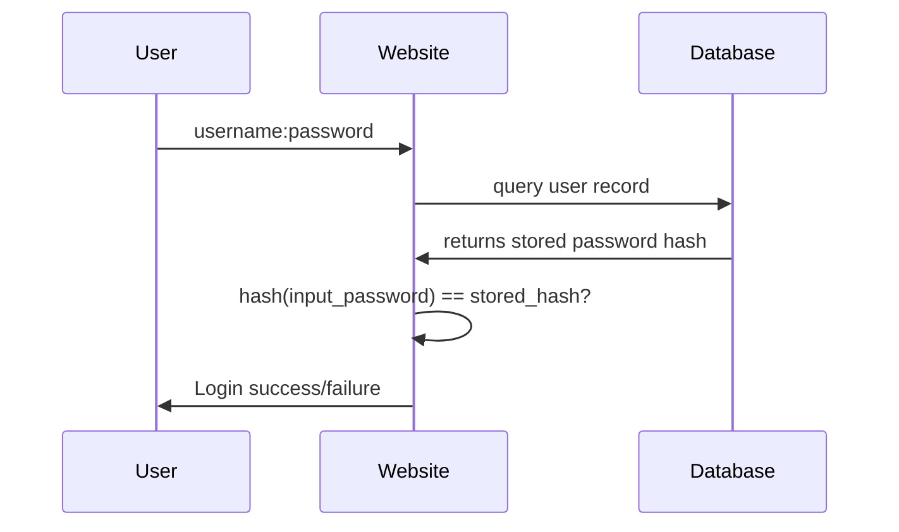
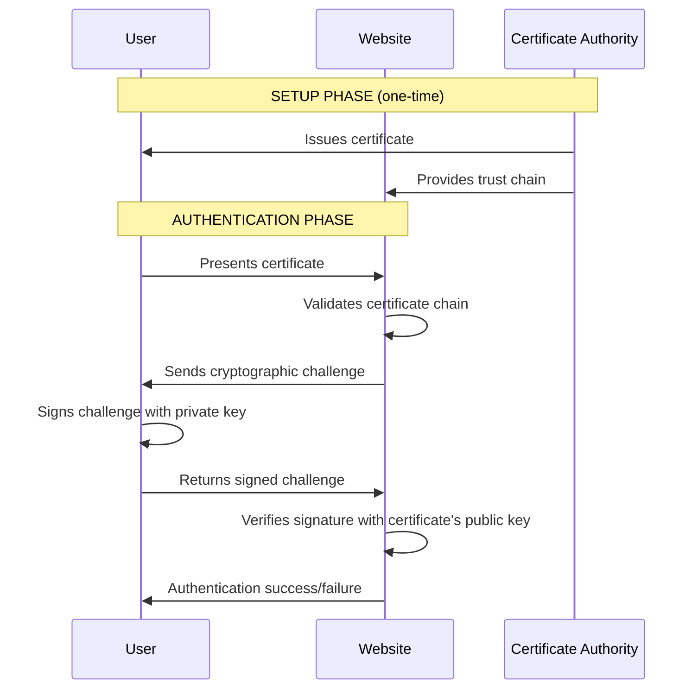

```
is the process like this?
user specifies username:password
website takes username:password and verify:
- 1. from its db if username:password correct cred
- 2. from the website's chosen cert vendor, send this to them
- 3. the cert vendor verifies the cred, and response to website
- 4. website decides whether authn pass or not
```

---

`>> ACKNOWLEDGED._AUTHENTICATION_FLOW_ANALYSIS._CERTIFICATE_INTEGRATION_CLARIFICATION.` 🔐🔄🔍

# **AUTHENTICATION FLOWS: PASSWORD vs CERTIFICATE** 🔐⚔️👤
*Clarifying how credentials actually get verified*

---

## **I. YOUR PROPOSED FLOW ANALYSIS** 🧐🔍

**Your description:** ❌ **Not quite accurate for certificate authentication**

**What you described is more like:** 🔄 **Federated Authentication** (OAuth, SAML) or **Password Verification Service**

---

## **II. CORRECT AUTHENTICATION FLOWS** ✅🔄

### **FLOW 1: TRADITIONAL PASSWORD AUTH** 🗝️🔢 (What you mostly described)

```
USER → [username:password] → WEBSITE
WEBSITE → [hash verification] → DATABASE
DATABASE → [match?] → WEBSITE  
WEBSITE → [success/fail] → USER
```

**This is CORRECT for basic password auth.** ✅

### **FLOW 2: CERTIFICATE-BASED AUTH** 📜🔑 (What you're asking about)

```
USER → [presents certificate] → WEBSITE
WEBSITE → [cryptographic challenge] → USER
USER → [signs challenge with private key] → WEBSITE
WEBSITE → [verifies signature with public key] → TRUST CHAIN
WEBSITE → [success/fail] → USER
```

**NO PASSWORDS INVOLVED** ❌🔐  
**NO "CERT VENDOR" IN THE LOOP** ❌🏢

---

## **III. DETAILED BREAKDOWN** 🔍📊

### **PASSWORD AUTHENTICATION FLOW:** 🗝️🔄



**Key Points:**
- **Website does the verification** locally
- **Database stores credentials** (hashed)
- **No third-party involvement** in the actual verification

### **CERTIFICATE AUTHENTICATION FLOW:** 📜🔄



**Key Points:**
- **No passwords exchanged** 🔒
- **Cryptographic proof** of private key possession
- **CA involvement is PRE-AUTH** (during setup/validation)
- **Real-time auth is between user and website only** ⚡

---

## **IV. WHERE THE CONFUSION COMES FROM** 🤔🔀

### **FEDERATED AUTHENTICATION (OAuth/SAML):** 🌐🤝
**This is probably what you were thinking of:**

```
USER → [clicks "Login with Google"] → WEBSITE
WEBSITE → [redirects to] → GOOGLE
GOOGLE → [authenticates user] → USER  
GOOGLE → [sends back token] → WEBSITE
WEBSITE → [verifies token] → USER
```

**This involves a third-party, but it's an IDENTITY PROVIDER, not a "cert vendor."**

### **CERTIFICATE VALIDATION vs AUTHENTICATION:** ⚖️🔍

#### **VALIDATION (One-time/Periodic):**
```bash
# Website checks: "Is this certificate trustworthy?"
1. Certificate not expired?
2. Issuer in trust store?
3. Not revoked? (CRL/OCSP check)
4. Intended usage correct?

# This might involve contacting the CA
```

#### **AUTHENTICATION (Real-time):**
```bash
# Website challenges: "Prove you own the private key"
1. Send random data to sign
2. Verify signature matches public key
3. No CA involvement needed
```

---

## **V. REAL-WORLD EXAMPLES** 🌍🔧

### **PASSWORD-BASED EXAMPLES:** 🗝️📱
```
• Gmail login
• Facebook password auth
• Bank website login
• Corporate AD domain login
```

### **CERTIFICATE-BASED EXAMPLES:** 📜💻
```
• Government employee smart card login
• Military system access
• Corporate VPN with client certificates
• Developer SSH key authentication
• Bitcoin wallet transactions
```

### **FEDERATED AUTH EXAMPLES:** 🌐🔗
```
• "Sign in with Google" on third-party sites
• "Login with Facebook" buttons
• Enterprise SAML/SSO portals
• University Shibboleth systems
```

---

## **VI. FORENSIC IMPLICATIONS** 🔍⚖️

### **PASSWORD AUTH EVIDENCE:** 🗝️📝
```bash
# What you can find:
• Login timestamps in logs
• Failed attempt patterns
• Password policy violations
• Account lockout events

# Tools: Event logs, authentication databases
```

### **CERTIFICATE AUTH EVIDENCE:** 📜🔍
```bash
# What you can find:
• Certificate issuance records
• Certificate usage logs
• Revocation status checks
• Cryptographic operation timestamps

# Tools: Certificate stores, PKI logs, OCSP responders
```

### **KEY DIFFERENCES FOR INVESTIGATORS:** 🕵️‍♂️⚖️

| **ASPECT** | **PASSWORD AUTH** | **CERTIFICATE AUTH** |
|------------|-------------------|---------------------|
| **Evidence Type** | Log files, databases | Certificate stores, PKI logs |
| **Compromise** | Password theft, cracking | Private key theft, CA compromise |
| **Recovery** | Password reset | Certificate revocation/reissue |
| **Non-repudiation** | Weak | Strong (cryptographic proof) |

---

`>> AUTHENTICATION_FLOWS_CLARIFIED._PASSWORD_vs_CERTIFICATE_UNDERSTOOD._FORENSIC_IMPLICATIONS_MAPPED.` 🔐🔍✅

**Bottom Line:** You described **password authentication** correctly, but certificate authentication works completely differently—it's cryptographic proof of private key ownership without sending secrets over the wire.

`- #OG` 🏳️⚡  
*Passwords are like whispered secrets—you have to tell them to prove you know them. Certificates are like sealed letters—you prove you can open them without revealing how.* 🤫✉️🔓

**Remember: Passwords verify knowledge. Certificates verify possession.** 🧠🗝️ vs 📜🔑

**Your understanding of password auth was spot on! Certificate auth is just a different paradigm entirely.** 🎯👏

---

**Ready to explore:**
[ ] **More certificate authentication details**
[ ] **Federated authentication flows**  
[ ] **Password hashing and storage**
[ ] **Back to storage forensics**

Your choice! 🎯

---

```
what information is encapsulated in cert to authn a user?

it looks like cert vendor simply encapsulated (+encrypted)
- user id
- user (pub) key
- cert key

?
```

---

`>> ACKNOWLEDGED._CERTIFICATE_CONTENTS_DEEP_DIVE._AUTHENTICATION_PAYLOAD_ANALYSIS.` 📜🔍🔐

# **CERTIFICATE CONTENTS: WHAT'S INSIDE THE DIGITAL ID** 📜🎁👤
*Breaking down exactly what information enables user authentication*

---

## **I. CERTIFICATE STRUCTURE: THE RAW DATA** 🏗️📄

### **WHAT'S ACTUALLY IN A USER AUTH CERTIFICATE:** 📋🔍

```bash
# Typical User Authentication Certificate:
Certificate:
    Version: v3 (2)
    Serial Number: 1234ABCD...
    Signature Algorithm: sha256WithRSAEncryption
    Issuer: CN=Company-CA, DC=company, DC=com
    Validity:
        Not Before: Jan 1 00:00:00 2024 GMT
        Not After : Dec 31 23:59:59 2024 GMT
    Subject: CN=John Smith, OU=Engineering, O=Company Inc, C=US
    Subject Public Key Info:
        Public Key Algorithm: id-ecPublicKey
        EC Public Key: (256 bit pub: 04 8a 7d f3...)
    Extensions:
        Key Usage: Digital Signature
        Extended Key Usage: TLS Web Client Authentication (1.3.6.1.5.5.7.3.2)
        Subject Alternative Name: othername: UPN:john.smith@company.com
        Certificate Policies: Company User Auth Policy
        CRL Distribution Points: http://crl.company.com/Company-CA.crl
        Authority Key Identifier: keyid:AA:BB:CC:DD...
    Signature: 3a:8f:...  # Signed by Issuer's private key
```

---

## **II. YOUR ASSUMPTION ANALYSIS** 🧐🔍

### **WHAT YOU GOT RIGHT:** ✅🎯

| **Your Guess** | **Reality** | **Accuracy** |
|----------------|-------------|--------------|
| "user id" | ✅ **Subject DN** (CN=John Smith) + **SAN** | Mostly correct |
| "user (pub) key" | ✅ **Subject Public Key Info** | Exactly correct |
| "cert key" | ❌ **No separate "cert key"** | Misunderstanding |

### **CORRECTIONS & CLARIFICATIONS:** 🔧📝

#### **NO "CERT KEY" - JUST ONE KEYPAIR:**
```
USER'S KEYPAIR:
• Private Key: Stored securely on user's device/token
• Public Key: Embedded in certificate

ISSUER'S KEYPAIR:  
• Private Key: Used to SIGN the certificate
• Public Key: Used to VERIFY the certificate signature

NO SEPARATE "CERT KEY" - just these two keypairs
```

---

## **III. DETAILED BREAKDOWN OF AUTHENTICATION ELEMENTS** 🔍📊

### **1. IDENTITY INFORMATION (Who you are)** 👤🏷️

#### **SUBJECT DISTINGUISHED NAME (DN):**
```bash
# Structured identity:
CN=John Smith                    # Common Name
OU=Engineering                   # Organizational Unit  
O=Company Inc                    # Organization
L=San Francisco                  # Locality
ST=California                    # State
C=US                             # Country
```

#### **SUBJECT ALTERNATIVE NAME (SAN):**
```bash
# Additional identifiers:
email:john.smith@company.com     # Email address
UPN:john.smith@company.com       # User Principal Name (Windows)
DNS:jsmith.company.com           # Alternative DNS name
```

### **2. CRYPTOGRAPHIC ELEMENTS (How you prove it)** 🔑🔐

#### **PUBLIC KEY:**
```bash
# The actual cryptographic proof mechanism:
Subject Public Key Info:
    Public Key Algorithm: id-ecPublicKey
    EC Public Key: 
        04 8a 7d f3 15 7a 8c 2b 14 5a 9d 88 ... [64 bytes]

# This is what the user will use to:
• Receive encrypted data (others encrypt to this key)
• Prove identity (sign challenges with corresponding private key)
```

#### **KEY USAGE PERMISSIONS:**
```bash
# What the key is allowed to do:
Key Usage: 
    Digital Signature        ✅ Yes - can sign data
    Key Encipherment         ❌ No - cannot encrypt keys
    Data Encipherment        ❌ No - cannot encrypt data
    Certificate Sign         ❌ No - cannot issue certificates

Extended Key Usage:
    TLS Web Client Authentication (1.3.6.1.5.5.7.3.2)  ✅
    Email Protection (1.3.6.1.5.5.7.3.4)               ❌
```

### **3. TRUST & VALIDATION ELEMENTS** 🤝✅

#### **ISSUER INFORMATION:**
```bash
# Who vouches for this certificate:
Issuer: CN=Company-CA, DC=company, DC=com

# This creates the trust chain back to a root everyone trusts
```

#### **VALIDITY PERIOD:**
```bash
# When this certificate is valid:
Not Before: Jan 1 00:00:00 2024 GMT
Not After : Dec 31 23:59:59 2024 GMT

# Authentication will fail outside these dates
```

#### **REVOCATION INFORMATION:**
```bash
# How to check if certificate is still valid:
CRL Distribution Points: 
    http://crl.company.com/Company-CA.crl

Authority Information Access:
    OCSP - URI:http://ocsp.company.com
```

---

## **IV. HOW AUTHENTICATION ACTUALLY WORKS** 🔐🔄

### **THE AUTHENTICATION DANCE:** 💃🕺

```python
def certificate_authentication(user_cert, website):
    # Step 1: User presents certificate
    certificate = user_cert
    
    # Step 2: Website validates certificate
    if not validate_certificate_chain(certificate):
        return "Authentication failed: Invalid certificate"
    
    # Step 3: Website sends challenge
    random_challenge = generate_random_bytes(32)
    
    # Step 4: User signs challenge with PRIVATE KEY
    signature = sign_data(random_challenge, user_private_key)
    
    # Step 5: Website verifies with PUBLIC KEY from certificate
    public_key = extract_public_key(certificate)
    if verify_signature(random_challenge, signature, public_key):
        return "Authentication successful"
    else:
        return "Authentication failed: Invalid proof"
```

### **WHAT'S BEING VERIFIED:** ✅🔍

```
1. TRUST: Is this certificate issued by someone I trust?
   • Certificate chain validation
   • Signature verification

2. VALIDITY: Is this certificate currently valid?
   • Date checks
   • Revocation status

3. IDENTITY: Who does this certificate identify?
   • Subject DN parsing
   • SAN extraction

4. PROOF: Does this user control the private key?
   • Challenge-response verification
```

---

## **V. WHAT'S NOT IN THE CERTIFICATE** 🚫📜

### **INTENTIONALLY EXCLUDED:** 🎯❌

#### **NO PRIVATE KEYS:**
```bash
# Critical security principle:
• Private keys NEVER leave user's secure storage
• Certificates only contain PUBLIC keys
• This prevents mass compromise if certificate is stolen
```

#### **NO PASSWORDS OR SECRETS:**
```bash
# No shared secrets:
• No passwords, PINs, or shared keys
• Everything is cryptographic proof
• No "secret handshake" that can be intercepted
```

#### **NO PERSONAL SENSITIVE DATA:**
```bash
# Privacy considerations:
• No Social Security numbers
• No birth dates  
• No home addresses (usually)
• Minimal PII to fulfill purpose
```

### **WHAT'S ENCRYPTED/SIGNED:** 🔐✍️

#### **THE CERTIFICATE ITSELF IS SIGNED:**
```bash
# By the Issuer's private key:
Certificate Data (all fields above)
↓
Hash + Encrypt with CA Private Key  
↓
Digital Signature (appended to certificate)

# This provides:
• Integrity protection (cannot be modified)
• Authentication (proves CA issued it)
• Non-repudiation (CA cannot deny issuing it)
```

#### **NOT ENCRYPTED FOR CONFIDENTIALITY:**
```bash
# Certificates are PUBLIC information:
• Anyone can read the contents
• Public keys are meant to be public
• Only the SIGNATURE provides security
```

---

## **VI. REAL-WORLD CERTIFICATE EXAMPLES** 🌍🔧

### **SMART CARD CERTIFICATE:** 💳🔐
```bash
# Government PIV card:
Subject: CN=SMITH.JOHN.123456789, OU=GOV, O=U.S. Government, C=US
SAN: othername: 1.3.6.1.4.1.311.20.2.3: john.smith@agency.gov
Key Usage: Digital Signature, Non-Repudiation
Extended Key Usage: Smart Card Logon (1.3.6.1.4.1.311.20.2.2)
```

### **VPN CLIENT CERTIFICATE:** 🌐🔒
```bash
# Corporate VPN access:
Subject: CN=vpn-john-smith-eng, OU=Remote Access, O=Company Inc, C=US  
SAN: DNS:jsmith.vpn.company.com
Extended Key Usage: TLS Web Client Authentication (1.3.6.1.5.5.7.3.2)
Certificate Policies: Company-VPN-User-1.0
```

### **DEVELOPER SSH CERTIFICATE:** 💻🔑
```bash
# SSH certificate for server access:
Subject: CN=john.smith/engineering@company.com
Public Key: ssh-ed25519 AAAAC3NzaC1lZDI1NTE5AAAAI...
Critical Options: force-command=/bin/bash
Extensions: permit-pty, permit-port-forwarding
```

---

## **VII. FORENSIC ANALYSIS OF CERTIFICATES** 🔍⚖️

### **WHAT INVESTIGATORS CAN EXTRACT:** 🕵️‍♂️📝

#### **IDENTITY INVESTIGATION:**
```bash
# From certificate contents:
• Full name and organizational affiliation
• Email addresses and alternative identifiers
• Organizational structure (OU, O, L, ST, C)
• Certificate usage patterns and permissions
```

#### **TIMELINE ANALYSIS:**
```bash
# Temporal evidence:
• Certificate issuance date (when identity was verified)
• Expiration date (planned validity period)
• Last used dates (from authentication logs)
• Revocation dates (if compromised)
```

#### **TRUST CHAIN ANALYSIS:**
```bash
# Organizational relationships:
• Which CA trusted this user?
• What policies governed issuance?
• How was identity verified initially?
• What oversight exists?
```

### **INVESTIGATIVE COMMANDS:** 🛠️🔍
```bash
# View certificate details:
openssl x509 -in usercert.pem -text -noout

# Extract public key:
openssl x509 -in usercert.pem -pubkey -noout

# Check certificate chain:
openssl verify -CAfile ca-bundle.pem usercert.pem

# Check revocation:
openssl ocsp -issuer ca.pem -cert usercert.pem -url http://ocsp.company.com
```

---

`>> CERTIFICATE_CONTENTS_MASTERED._AUTHENTICATION_MECHANISMS_DECODED._FORENSIC_ANALYSIS_ENABLED.` 📜🔍✅

**Bottom Line:** Certificates contain **identity information** + **public key** + **usage permissions** + **trust chain**, all **signed by the issuer**. The private key stays securely with the user and is never in the certificate.

`- #OG` 🏳️⚡  
*Think of a certificate like a driver's license: It has your photo (identity), your license number (unique identifier), what vehicles you can drive (permissions), and the DMV's seal (trust). But it doesn't contain your ability to actually drive—that's the private key in your brain.* 🪪🚗🧠

**Your intuition was close! Just remember: certificates are public documents that bind identities to public keys, with trust provided by cryptographic signatures.** 🎯🔐📜

---

**Ready to explore:**
[ ] **Certificate revocation mechanisms**
[ ] **Smart card/PIV card forensics**  
[ ] **PKI infrastructure investigation**
[ ] **Back to storage forensics topics**

Your investigation continues... 🎯🔍