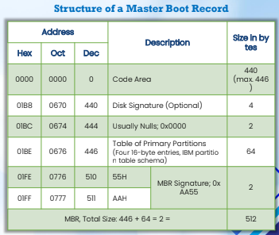
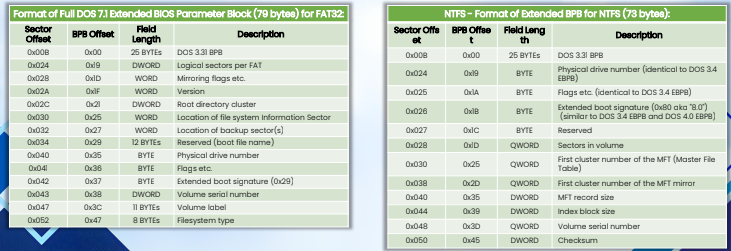
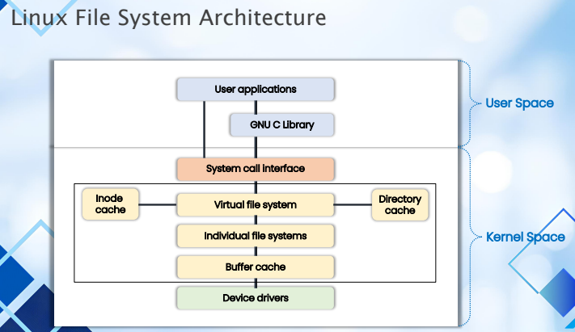

# 1 from NCSA slides
```
l1 = describe diff types of disk drives and their characteristics
l2 = explain the logical structure of a disk
l3 = understand the booting process of windows, linux, and macos
l4 = understand various file systems of windows, linux, and macos
l5 = understand file system analysis
l6 = understand storage systems
l7 = understand encoding standards and hex editors
l8 = analyze popular file formats using hex editors
```

---

# l1
```
describe diff types of disk drives and their characteristics
- understanding hdd
- understanding ssd
- disk interfaces
```

```
hdd = non-volatile, magnetic, rpm perfomance (revolutions per minute), moving parts, sector > cluster > track
- sector = 512 bytes (hdd), 4096-byte (4 kb; latest hdd)
  > factory track-positioning
  > continuous

data density = amount of data that can be stored within a given physical space on the disk's magnetic platters
- zoned bit recording, multiple zone recording
- track density = concentric circles, number of tracks
- bit density = bits per inch (bpi), linear inch of a track
- areal density = data areal density is a critical measure of data storage on hdd, quantifies amount of data that can be stored in a unit of area
  
locigal block addressing (lba) and disk capacity calculation
- lba = method to address/access data on modern hdd/ssd, and etc, assigning unique logical block number
- disk capacity calculation
  > byte = total number of LBAs x block size

measuring performance
- speed, reliability, efficiency
  > data transfer rate (MB/s), latency (ms), seek time (ms), iops, burst rate (peak data transfer rate), throughput (actual data transfer rate)
```

```
ssd = non-volatile, NAND flash memory, faster, no moving parts
> nand flash memory (data storage unit), controller (embedded processor), dram (volatile memory), host interface
```

```
disk interfaces
> serial ata/sata (ahci) = thinner cables, faster data transfer rates
> scsi = ANSI standard interfaces, parallel bus structure
> serial attached scsi = high-speed interface, protocol
> PCIe = high-speed expansion bus standard, connect various hardware components
> NVMe = protocol, interface, designed for ssd, connect and comm with a computer's motherboard or storage controller
```

> [ssd-dram](./ssd-dram.md)

---

# l2
```
explain the logical structure of a disk
> logical structure of disks
> clusters
> lost clusters
> slack space
> mbr (master boot record)
> disk partitions
> bios parameter block (bpb)
> globally unique identifier (guid)
```

```
file system and software = logical structure of disks
> consistency, performance, compatibility, expandability
> key components
> > bit, sector, cluster, file system, files, directory, file metadata, 
> > file allocation table (fat), logical volumnes, partition table, mbr or guid partition table (gpt), lba, raid config

clusters = smallest accessible storage unit, combining sectors to ease the process of handling files
> 512 bytes = 4 kb
> steps to change cluster size in windows ...

lost clusters = fat error, os marks clusters as used but does not allocate any file to them
> logical error, not physical
> user shut down without closing file properly
> chkdsk.exe

slack space = wasted area of a cluster
> between end of file and end of cluster
> if a cluster size 32 kb, and a file 10 kb, storing will leave 22 kb of slack space
> may contain relevant suspect information

mbr = first sector (sector zero) of a data storage device
> in practice, mbr ~ 512-byte boot sector (partition sector)
> holding partition table, bootstrapping, 32-bit disk signature
> structure of a mbr (see im)

disk partitions = creation of logical drives (hdd/ssd)
> organizing, segragating
> primary (file system, system area, upto 4 primes), extended (files stored)

bios parameter block (bpb)
> data structure at sector 1 in the volume boot record (vbr)
> explain physical layout of a disk volume
> help os understand file system
> size depending on factors such as file systems fat32 vs ntfs

guid (globally unique identifier)
> 128-bit unique number, windows, identifying a specific device, document, database entry, and/or user
> displayed as 32 hexadecimal digits with groups separated by hyphens
> uses
> > identify component object model (com) and dynamick-link libraries (DLLs) in windows registry
> > implement primary key values in db tables
> > record/track session
> > identify user accounts
> `6B29FC40-CA47-1067-B31D-00DD010662DA`

gpt (guid partition table)
> standard partitioning scheme for guid
> uefi (unified extensible firmware interface)
> replace legacy bios firmware interfaces
> uefi overcomes limitations of the mbr partitioning scheme
> protective mbr
> > occupies first positions of gpt at lba 0
> > helps legacy systems solve compatibility issues
> header
> > managing partitions
> > first 34 sectors
> > efi part
> partition array
```





---

# l3
```
booting process of windows, linux, macos
> what is booting process
> essential windows sytem files
> windows boot process bios-mbr, uefi-gpt
> macos boot process
> linux boot process
```

```
booting
> cold = power off, warm = still power on

essential windows system files and components
> ntoskrnl.exe
> bootmgr
> winload.exe
> registry hlives
> ntkrnipa.exe
> hal.dll
> system32 directory
> win32k.sys
> ntdll.dll
> kernel32.dll
> user32.dll
> gdl32.dll
> boot config data (bcd)
> winlogon.exe
> lsass

windows boot process: bios-mbr, uefi-gpt
identifying mbr partition, gpt

analyzing gpt header and entries
> sleuthkig (mmls command), hex editor

gpt artificats
> repartitioned, converted to gpt
> converted to mbr
> unique identifying information
> hidden info using flexible/extensible disk partitioning schemes, or headers

macos boot process
linux boot process

```

---

# l4
```
various file systems of windows, linux, macos
- windows: fat, exfat, ntfs, ReFS
- linux: fhs, ext2-4, journaling file system
- macos: hfs+, apfs
```

[fat-exfat](./fat-exfat.md)
[fat-ntfs-ext4-apfs](./fat-ntfs-ext4-apfs.md)
[efs-encryption](./efs-encryption.md)
[sparsefile](./sparsefile.md)
[ReFS](./refs.md)
[l4sum](./l4sum.md)



```
superblocks, inodes, data blocks
> superblack = store info regarding characteristics of a file system {type, size, empty or filled file system blocks, locations of inode tables and sizes, block size, etc.}
> > to view:
> > `dumpe2fs <path-to-partition> | grep -i superblock`
> inode = metadata pertaining to a file or directory on linux filesystem, identified by a unique inode number, or index number
> > inode number = store attributes of a file {size, type, permission/access control, datetime, filelocation, etc.}
> > `ls -i1` ### -i(integer one)
> data block = store actual contents of a file
> > a data block only to one file in a file system (1-1 mapping block-file)
> > start at then end of the file's inode list
> > can store contents of an entire directory
> > delete = change data block tag from used -> free

macos - major components of apfs
> container superblock, checkpoint superblock descriptor, bitmap sructures, volume superblock, file and folder b-tree, extents b-tree, snapshots, checkpoints
```

[inode](./inode.md)
[journaling-datablocks](./journaling-datablocks.md)

---

# l5
```
file system analysis
- autopsy
- tsk (the sleuth kit)
- file system timeline creation and analysis using tsk
- ntfs timestamp rules in windows and linux
```

```
tsk
> `fsstat` ### retrieving and displaying details associated with as file system
> `istat` ### displaying {uid, gid, mode, size, ...} all the disk units a structure has allocated
> `fls` ### list file and directory names in a disk image
> `img_stat` ### displaying details of an image file
> `ffind` ### find name of file or directory
> `ils` ### obtain inode info, including of removed files
```

```
macb timestamp
> modified, accessed, changed ($MFT modified), birth (file creation time)
> file system metadata
> > saved location typically in two places
> > > $STANDARD_INFO attribute
> > > $FILE_NAME attribute
```

```
ntfs timestampe rule (window, linux)
- file creation, access, mod, rename, delete
```

---

# l6
```
storage systems
> raid
> > levels of raid storage system
> > just a bunch of drives/disks (jbod)
> > host protected areas (hpa) and device configuration overlays (dco)
> nas/san storage
> > network-attached storage (nas)
> > storage area network (san)
> > diff(nas, san)
```

[raid-nas-san](./raid-nas-san.md)

```
jbod
> a type of data storage configuration for multiple hard disks that do not support raid arrays
> concatenation of multiple hard disks, spanning
> does not support {redundancy, parity check, striping} unlike raid
> a single disk failure = system not fail, data on other disks remains intact
```

```
hpa/dco are hidden areas of a hard disk -> hidden info
> hpa (host protected areas)
> > reserved area -> data in a way to user, bios; os cannot {modify, change, access}
> > info about hdd utilities, diagnostic tools, system restore, encryption keys, boot sector code, etc.
> dco (device config overlays)
> > additional hidden area, modern hard disks that enables system vendors to buy hdds of varying sizes from different manufacturers and configure them to have equal number of sectors
> > enable/disable features on the hdd

> hpa and dco are of concern during an investigation as many tools fail to detect their presence
> tools
> > `EnCase, TAFT (an ATA [IDE] forensics tool, TSK, etc.`
```

---

# l7
```
encoding, hex editors
> character encoding standards {ascii, unicode}
> offset
> hex editors
> hexadecimal notations
```

```
ascii (american standard code for information interchange)
> 128 chars, 7-bit
> > number, lower, upper, punctuations, control codes, space

unicode (internation standard), utf-{8,16,32}

offset <- 'A'+20

hexadecimal notation
> base 16: {0-9,A-F}
> 0:hex = 0000:binary = 0:base10
> C:hex = 1100:binary = 12:base10
```

---

# l8
```
analyze popular file formats using hex editor
> image file analysis {jpeg, bmp, hex view}
> pdf {header, body, xref table, trailer, `%%EOF`}
> {word, powerpoint, excel, hex view}
```

```
`.doc/.docx`
> word document stream/main stream
> summary information streams {\005Summary Information, \005DocumentSummaryInformation}
> table stream (0Table or 1Table)
> object streams (embedded OLE objects)

`.ppt/.pptx`
> current user stream (CurrentUserAtom)
> powerpoint doc stream (presentation layout)
> pictures stream (optional, embedded image files)
> summary information streams (optional, {\005SummaryInformation, \005DocumentSummaryInformation})

`.xls/.xlsx`
> an object linking and embedding (OLE) compound file saved in the binary interchange file format (biff)
> streams (primary system, may contain substreams)
> substreams
> > global
> > worksheet

> records
> > each workbook's features {size, type, data}
```

```
popular file formats
> jnt, epub
> zip, rar
> wmv, flv, mp4, avi, mp3, aiff, wav, ogg
```

---

[...back](../../0-landing-chfi.md)
