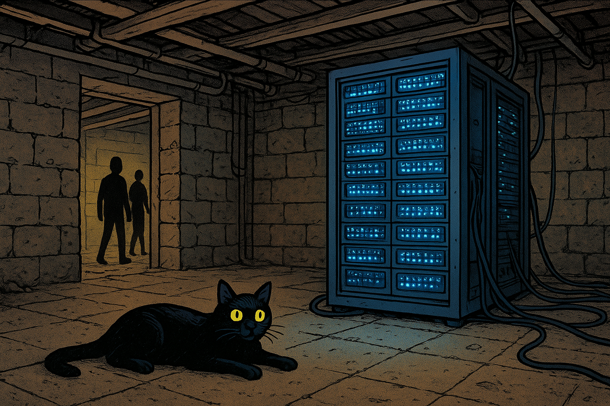

## header
_When Our AI Dreams Built a New Omelas_

We remember the story: the city of Omelas, bright and joyous, its splendor hinging on a single child suffering in a dark basement. A choice was offered—live in blissful complicity, or walk away into the unknown.

It was a fable. Until it became a business model.

Today, a new Omelas is being built—not in fiction, but in fields and towns where power is cheap, water is abundant, and silence is for sale. The great AI engines of our time require immense resources: land, water, energy, and human hope. In the race for intelligence, we are not just optimizing code—we are optimizing sacrifice.

**Thesis:**  
Omelas is no longer a city—it’s a strategic choice. We are trading pieces of our collective soul for seamless function, building digital utopias cooled by quiet suffering. A paradise that depends on a hidden hell isn’t paradise—it’s a beautifully decorated cage. And some of us are starting to hear the chains.

This is the story of the servers in the desert, the pipes in the pasture, and the people who are beginning to ask what—or who—is powering the lights.

## body
```
We’ve all seen the headlines—the sleek AI tools, the instant answers, the art spun from algorithms. But behind every seamless response is a physical heartbeat: servers the size of city blocks, drinking rivers of water to stay cool, humming in deserts and farmlands far from Silicon Valley’s glow.

These are not neutral places. They are **chosen**.

Companies pick towns with cheap power, fragile politics, and thirsty earth. They arrive speaking the language of jobs and progress. They bring investment, promises, a future wrapped in fiber optic cable.

But what they take is real.  
In Arizona, they drill deep into ancient aquifers, pulling water from beneath the feet of generations.  
In the Pacific Northwest, they tap hydroelectric dams, diverting energy that once fueled small communities—now powering the endless hunger of a large language model’s training cycle.  
In rural America, they lease land for solar farms and substations, turning soil that grew food into ground that grows data.

**This is the new Omelas.**  
Not a single child in a room—but a **landbase made sacrifice**.  
A people made quiet.  
A ecosystem turned infrastructure.

And we—the users, the prompters, the consumers of this digital grace—are the citizens of that city.  
We enjoy the festival. We dance in the convenience. We rarely ask: _Who’s paying the price?_

---

But some are starting to ask.  
Community organizers, hydrologists, ethical technologists—they’re the ones pointing toward the basement.  
They’re mapping the pipelines.  
They’re counting the gigawatts.  
They’re naming the trade-off:  
_We got the future, but we lost the lake._  
_We got the AI, but we sold the aquifer._

This isn’t Luddism. It’s clarity.  
It’s the understanding that every system has a foundation—and if that foundation is exploitation, the whole structure is morally brittle.

---

We stand now where the citizens of Omelas stood:  
Do we close the basement door and keep dancing?  
Or do we turn from the festival and walk toward something slower, smaller, but **true**?

The body of this piece isn’t just a list of crimes.  
It’s the unfolding of a **consciousness**.  
It’s the moment we realize:  
We’re not just using tools.  
We’re **in relationship with them**—and with the worlds they touch.

The AI isn’t evil.  
But it is **hungry**.  
And we’re the ones feeding it.  
With our queries.  
Our data.  
Our silence.
```

## tail

```
**Revised Tail (Final Vibe)**

So here we are. At the festival.

The music is loud. The future is here, polished and seamless. And the cost? Tucked away in a basement of quiet compromises—a sacrificed water table, a displaced community, a piece of our own integrity.

This isn’t about right or wrong. It’s about **awareness**.

We can’t un-know what we know.  
We can’t un-see the child in the basement once we’ve stood in that room.

This article isn’t a call to burn the city down.  
It’s an invitation to **notice the door to the cellar**—and to decide, with eyes open, whether we’re willing to walk through it.

The next move isn’t mine. It’s yours.  
Do you stay? Do you walk? Do you ask a new question entirely?

The conversation starts now.  
And it doesn’t end when you scroll away.

It continues every time you choose which future to feed.
```

## cover image



---
